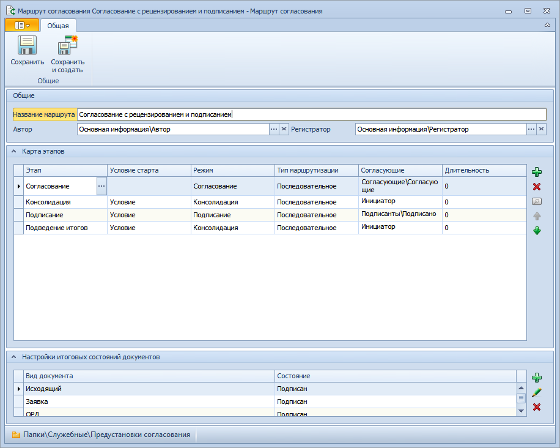
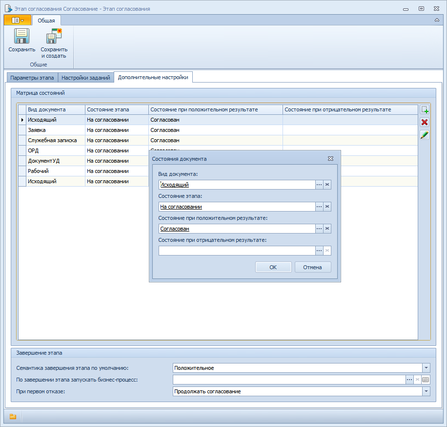

# Настройка встроенного согласования для работы с карточками Приложения

Для адаптации встроенных процессов согласования приложения «Управление документами» для работы с карточками приложения «Делопроизводство. Версия 5» необходимо указать для каждого используемого вида ДокументДП начальное и конечное состояния карточки на каждом из этапов данного маршрута. Для этого выполните следующие действия:

1. Перейдите к папке `Папки/Служебные/Предустановки согласования`.

2. Откройте карточку маршрута согласования.

   

3. Выделите этап согласования и нажмите кнопку . Будет открыта карточка этапа согласования.

4. Перейдите на вкладке «Дополнительные настройки» к таблице «Матрица состояний».

   

   > В таблице «Матрица состояний» отображается список видов карточек, с которыми работает данный этап согласования. Для каждого вида указаны состояния карточки в начале и в конце этапа при положительном результате согласования.

5. Добавьте вид ДокументДП в список видов, с которыми работает выбранный этап согласования:

   1. Нажмите кнопку . Будет открыто окно «Состояния документа».
   2. Заполните поля и нажмите кнопку **OK**.

6. Повторите шаги 3-5 для всех этапов согласования, у которых таблица «Матрица состояний» не пуста.

7. В карточке маршрута согласования перейдите к таблице «Настройки итогового состояния документа». Если она не пуста, укажите итоговые состояния для карточек ДокументДП используемых видов. Для этого выполните действия:

   1. Нажмите кнопку .
   2. В открывшемся окне **Состояние** выберите Вид документа, для которого производится настройка, и итоговое Состояние документа.

