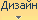
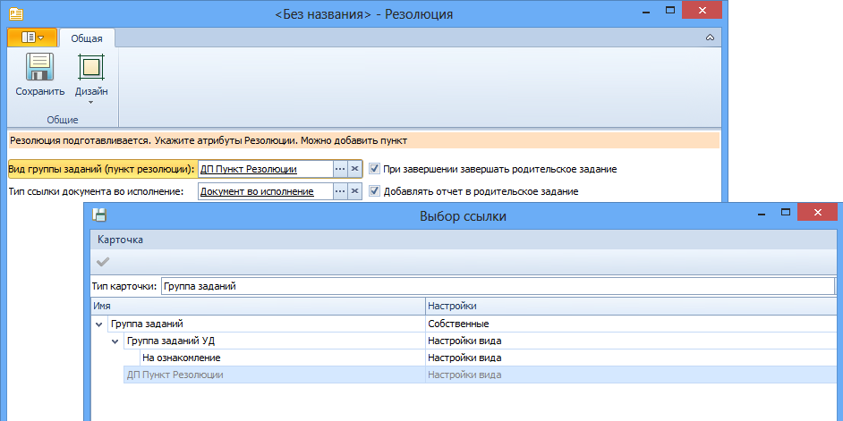

# Настройка шаблона резолюций

Шаблоны карточек Резолюция используются для создания карточек резолюции с указанными настройками и заполненными полями.

Пользователь, выполняющий настройку шаблона, должен входить в группу Администраторы УД.

Для создания шаблона карточки резолюции выполните следующие действия:

1. Создайте карточку резолюции в Windows-клиенте.

2. Нажмите кнопку  на ленте карточки и выберите из списка опцию Настройки. Карточка переключиться в режим, в котором отображаются только элементы управления настройки карточки.

3. Заполните поля свойств резолюции:

   1. Выберите Вид группы заданий. Для этого нажмите кнопку **…** справа от поля, в открывшемся окне «Справочник видов карточек» выберите из списка значений поля «Тип карточки» вариант «Группа заданий», выделите строку «ДП Пункт Резолюции» и дважды щелкните по ней левой кнопкой мыши.

      

   2. Выберите из справочника ссылок значение «Тип ссылки документа во исполнение». В дальнейшем к карточке задания по резолюции будет прикладываться документ с выбранным типом ссылки.

   3. При необходимости установите флаги **При завершении завершать родительское задание** и **Добавлять отчет в родительское задание**.

   4. Нажмите кнопку  на ленте карточки, выберите из списка вариант «Подготовка» и заполните поля, значения которых будут общими для всех резолюций, создаваемых по этому шаблону. Данное действие не является обязательным для выполнения.

   5. Сохраните изменения в карточке и закройте ее.

   6. Конвертируйте карточку в шаблон одним из способов:

      - выберите из контекстного меню карточки команду **Конвертировать в шаблон**;
      - выберите карточку в представлении, перейдите на ленте к вкладке «Карточки» и нажмите кнопку **Конвертировать в шаблон**. 

