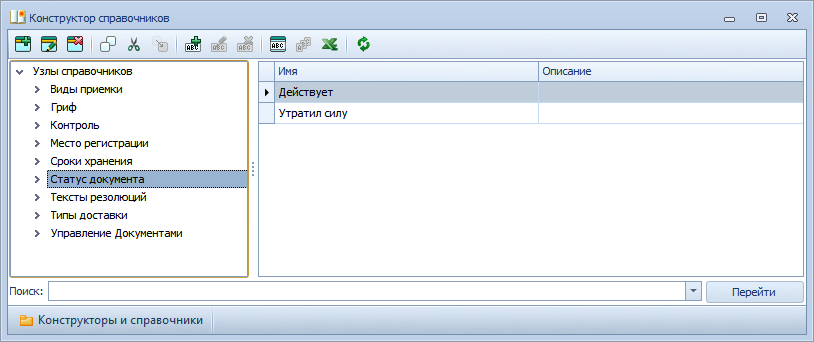

# Настройка возможных значений атрибутов документа

Значения атрибутов карточки ДокументДП задаются в Конструкторе справочников. Администратор может установить значения для следующих атрибутов:

- Виды приемки (значения по умолчанию: «Контроль организации» и «Контроль подразделения»);
- Гриф (значения по умолчанию: «Г» и «С»);
- Контроль (значения по умолчанию: «На контроле» и «Снят с контроля»);
- Место регистрации;
- Сроки хранения (значения по умолчанию: «5 лет», «Постоянно», «До замены новыми», «До минования надобности» и «10 лет»);
- Статус документа (значения по умолчанию: «Действует» и «Утратил силу»);
- Тексты резолюций;
- Типы доставки (значения по умолчанию: «Письмо_ПО», «Заказное письмо_ПО», «Эл. почта» и «Курьер»).

