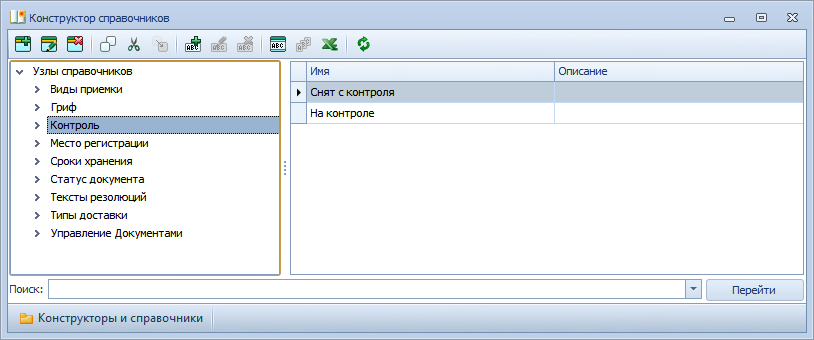

# Настройка состояний контроля документов

В Приложении предусмотрен контроль исполняемых документов (документы вида Входящий, Информационно-справочный и Распорядительный).

По умолчанию настроены два вида состояния контроля: «На контроле» и «Снят с контроля»; удалить их нельзя.

Остальные состояния контроля могут настраиваться администратором в зависимости от регламентов организации.