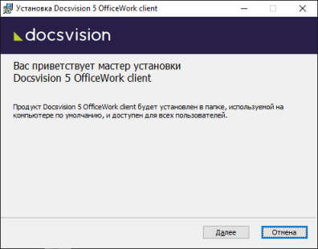
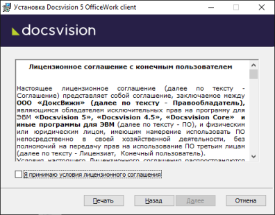
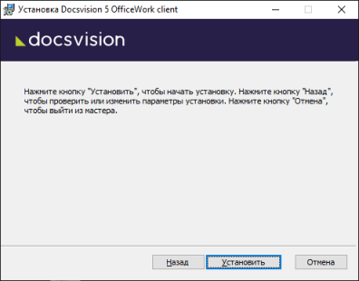

# Установка клиентской части Приложения из установочного пакета

Чтобы установить клиентскую часть приложения «Делопроизводство. Версия 5» вручную:

1. Запустите пакет установки:

   - `Docsvision 5 OfficeWork client.msi` – чтобы установить Приложение с областью установки «Для текущего пользователя»;
   - `msiexec /i "Docsvision 5 OfficeWork client.msi" ALLUSERS=1` – чтобы установить Приложение с областью установки «Для всех пользователей». Для данного варианта установки требуются административные права.

   Будет открыт мастер установки.

   

2. Примите условия лицензионного соглашения для продолжения установки.

   

3. Нажмите на кнопку **Установить** и дождитесь завершения установки Модуля.

   

4. Нажмите на кнопку **Готово**, чтобы закрыть мастер установки.