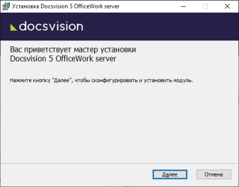
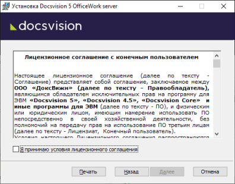
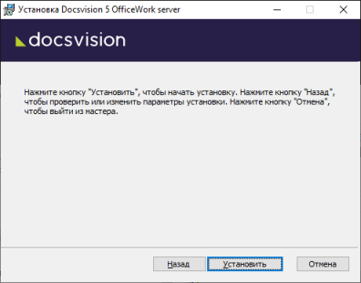
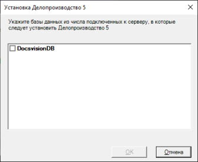

# Установка серверной части Приложения

Серверная часть приложения «Делопроизводство. Версия 5» должна быть установлена на компьютер с сервером Docsvision.

Пользователь, выполняющий установку, должен обладать правами локального администратора, являться администратором Docsvision (быть членом группы «Docsvision Administrators» на компьютере с сервером Docsvision), входить в группу сотрудников «Администраторы УД».

1. Запустите Командную строку от имени администратора.

2. Запустите в командной строке пакет установки `Docsvision 5 OfficeWork server.msi`.

   

3. Примите условия лицензионного соглашения для продолжения установки.

   

4. Нажмите на кнопку **Установить** и дождитесь завершения установки Модуля.

   

5. Выберите базы данных Docsvision, в которые будет установлено Приложение, и нажмите **OK**. В процессе загрузки также будет предложено перезагрузить сервисы Docsvision. Согласитесь с перезагрузкой сервисов.

   

6. Нажмите на кнопку **Готово**, чтобы закрыть мастер установки.