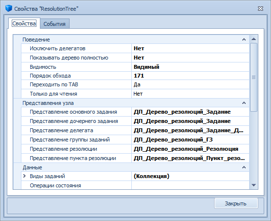
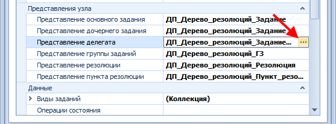
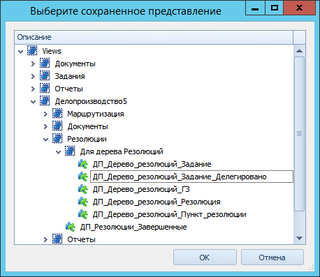

# Настройка свойств элемента управления «Дерево резолюций»

Свойства элемента управления *Дерево резолюций* настраиваются в Конструкторе разметок. Для изменения или настройки свойств элемента выполните следующие действия:

1. Откройте Конструктор разметок. Откройте разметку карточки, содержащей элемент управления *Дерево резолюций*.

2. Найдите элемент управления *Дерево резолюций*. 

3. Откройте окно свойств элемента управления. Для этого щелкните правой кнопкой мыши по формируемому полю и в раскрывшемся списке выберите пункт **Свойства**.

4. Щелкните по ссылке **Больше**. Будет открыто окно настройки элемента управления.

    

5. При необходимости с помощью атрибутов категории «Поведение» настройте поведение дерева резолюций.

6. Атрибуты категории «Представления узла» используются для отображения информации об узлах Дерева резолюций различных типов. Каждому типу узла сопоставлено представление, столбцы которого соответствуют тем полям карточек, сведения из которых выводятся на правую панель *Дерева резолюций*. Для смены представления следует выполнить действия:

   1. Нажать кнопку выбора в поле узла, представление для которого нужно сменить.

      

   2. В диалоговом окне «Выберите сохраненное представление» выделите в дереве представлений нужное и нажмите кнопку **OK**.

      

7. Сохраните изменения во всех окнах и в разметке. Закройте окно конструктора.