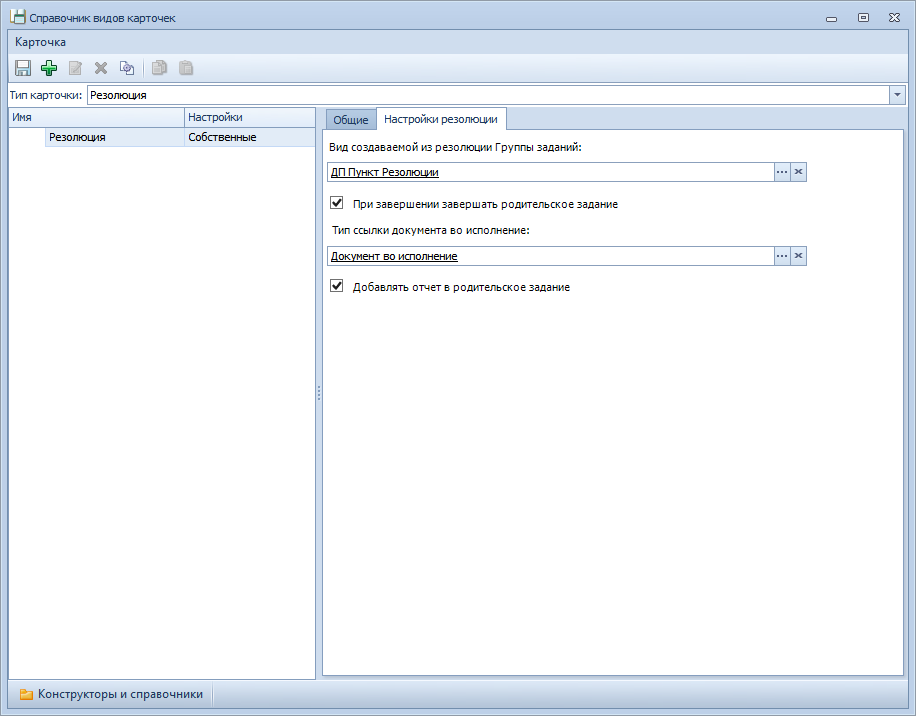

# Настройки вида карточки «Резолюция»

Настройка вида карточки Резолюция осуществляется в Справочнике видов карточек.

Администратору доступны следующие настройки вида карточек:

- **Общие настройки** – стандартные общие настройки карточек (см. документ *Модуль «Docsvision 5. Базовые объекты». Руководство администратора*, пункт «Общие настройки»);
- **Настройки резолюции**:
  - **Вид создаваемой из резолюции Группы заданий** – определяет вид карточки Группа заданий, которая будет создаваться при добавлении пункта резолюции;
  - **При завершении завершать родительское задание** – указывает, что при завершении дочерней резолюции должно автоматически завершаться ее родительское задание (если оно при этом не имеет других незавершенных дочерних резолюций);
  - **Тип ссылки документа во исполнение** – определяет тип ссылки, с которым будет присоединяться к карточке задания документ во исполнение резолюции;
  - **Добавлять отчет в родительское задание** – указывает, что в карточку родительского задания при его автоматическом завершении должны добавляться ссылки на отчеты исполнителей заданий дочерней резолюции, а в поле «Отчет» переноситься текстовые отчеты из подчиненных заданий.