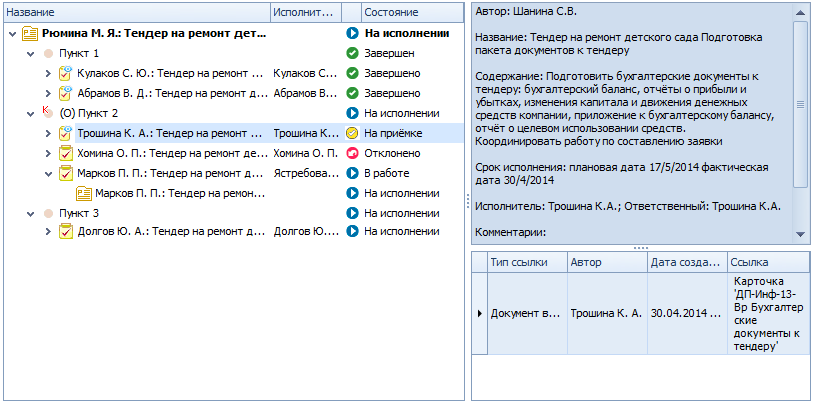

# Настройка отображения информации о дереве резолюций

В приложение «Делопроизводство. Версия 5» входит элемент управления *Дерево резолюций*, предназначенный для отображения созданных из резолюции заданий и дочерних резолюций в виде упорядоченной иерархической структуры (дерева). В узлах дерева резолюций (за исключением пунктов) прописывается дайджест карточки, текущий исполнитель и состояние задания.

Визуально элемент управления *Дерево резолюций* состоит из двух панелей. На левой панели отображается дерево и основные сведения о его узлах, а на правой – подробная информация о выделенном узле дерева. 

Для отображения информации об узлах дерева в Приложении настроены специальные представления: их столбцы соответствуют полям карточек, сведения из которых выводятся на экран.

