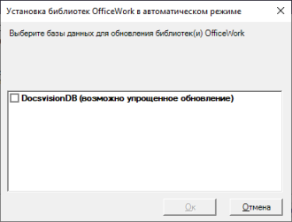

# Порядок обновления

1. На компьютере с сервером Docsvision остановите все сервисы Docsvision (в IIS и службах Windows). Если используется кластер серверов Docsvision / СУБП, остановите сервисы на всех узлах.

2. Установите новую версию приложения из пакета установки `Docsvision 5 OfficeWork server.msi`. Существующую версию удалять не требуется. 

   Перед завершением установки запустите сервисы Docsvision (в IIS и службах Windows) на серверах Docsvision и СУБП.

   Будет предложено выбрать обновляемые базы данных Docsvision. 

   

3. Выберите обновляемые базы данных и нажмите **OK**. Дождитесь завершения процесса.

4. Обновите версию на всех узлах кластера Docsvision, СУБП и Web-клиента.

5. Клиентские компоненты модуля на компьютерах пользователей будут обновлены автоматически при запуске Windows-клиента. Если требуется, их можно обновить вручную из пакета установки  `Docsvision 5 OfficeWork client.msi`.