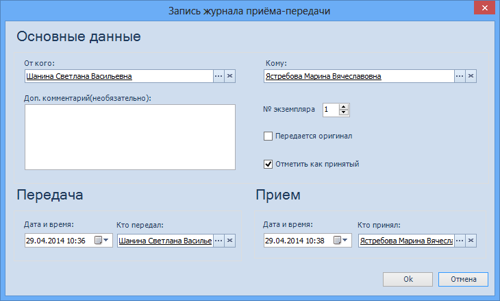

# Прием-передача документа

Документы вида Входящий, Информационно-справочный, Исходящий и Распорядительный могут передаваться между отделами организации. Прием-передача документов фиксируется в Журнале приема-передачи, расположенном на вкладке Журнал и категории карточки.

Для проставления отметки о приеме-передаче бумажного экземпляра документа выполните следующие действия:

1. Откройте карточку документа и перейдите на вкладку Журнал и категории.

   

2. Нажмите в секции Журнал приема-передачи кнопку **Добавить**. Будет открыто окно Запись журнала приема-передачи.

   

3. Заполните поля так, как это описано в разделе [Запись в журнале приема-передачи документа](Card_Doc_Tab_CatJourn_Journal_Entry.md). Нажмите кнопку **OK**.

4. Подтвердите передачу документа, проставив соответствующую отметку одним из способов: 

   - установить в окне Запись журнала приема-передачи флаг **Отметить как принятый**;
   - в таблице Журнал приема-передачи щелкнуть левой кнопкой мыши по отметке Принять.

   В результате обоих действий отметка «Принять» будет преобразована в отметку «Принято <ФИО принявшего документ>».

5. Для изменения данных записи приема-передачи документа выполните следующие действия:

   1. Выделите в таблице Журнал приема-передачи нужную строку.
   2. Нажмите кнопку **Изменить**, расположенную в верхней части секции.
   3. В открывшемся окне Запись журнала приема-передачи измените нужные данные и нажмите кнопку **OK**.

6. Для удаления записи журнала приема-передачи документа выполните следующие действия:

   - выделите в таблице Журнал приема-передачи нужную строку;
   - нажмите кнопку **Удалить**, расположенную в верхней части секции.