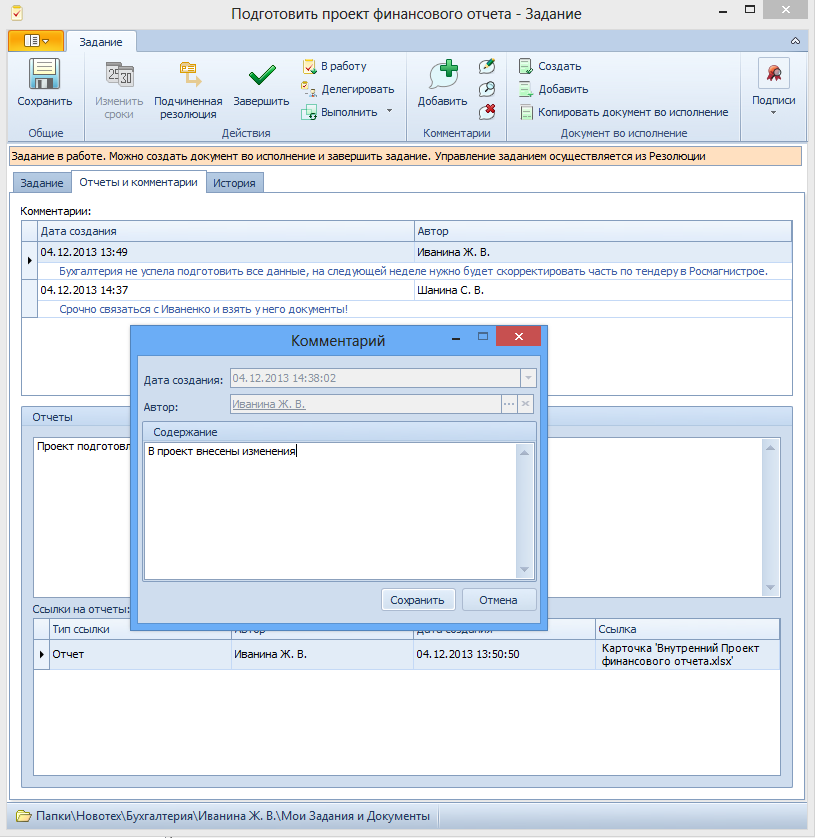

# Добавление комментария к заданию

Чтобы добавить комментарий в карточку задания, выполните следующие действия: 

1. Откройте нужную карточку Задание и перейдите на вкладку Отчеты и комментарии.

2. Нажмите на ленте карточки кнопки **Комментарии** → **Добавить** или выберите в контекстном меню поля комментариев пункт **Добавить**.

   

3. В открывшемся окне Комментарий введите комментарий в поле Содержание.

4. Нажмите кнопку **Сохранить**. Окно Комментарий будет закрыто, а введенный комментарий добавится в таблицу.