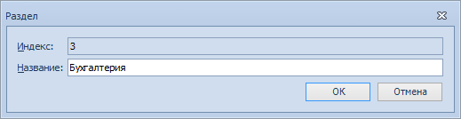

# Добавление нового раздела номенклатуры

Чтобы добавить в дерево номенклатуры новый раздел, выполните следующие действия:

1. Откройте Справочник номенклатуры дел 5.

2. Выберите в поле Год номенклатуру, в которую нужно добавить раздел.

3. Выделите в дереве номенклатуры корневой узел «Номенклатура дел <год номенклатуры>» года или уже существующий раздел, в который нужно добавить новый подраздел.

4. Нажмите на ленте карточки кнопку **Добавить раздел** или выберите из контекстного меню выделенного узла дерева команду **Добавить раздел**.

5. В открывшемся окне Раздел укажите название раздела.

   

6. Нажмите кнопку **OK**.

Новый раздел будет добавлен в дерево номенклатуры.

