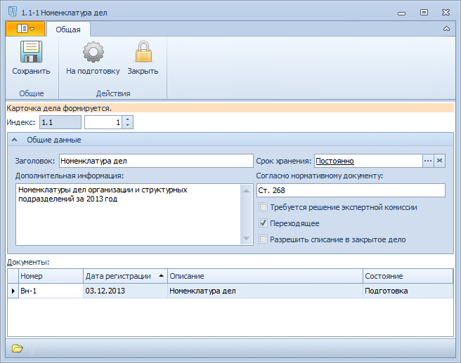

# Карточка «Дело»

Карточка Дело предназначена для хранения сведений о деле Справочника номенклатуры дел 5. 

Пользовательский интерфейс карточки включает следующие элементы: Лента инструментов, Строка состояния, поле Индекс, набор полей и флагов для ввода регистрационных данных дела и описания способов работы с ним, таблица Документы, содержащая ссылки на хранящихся в деле документы.

