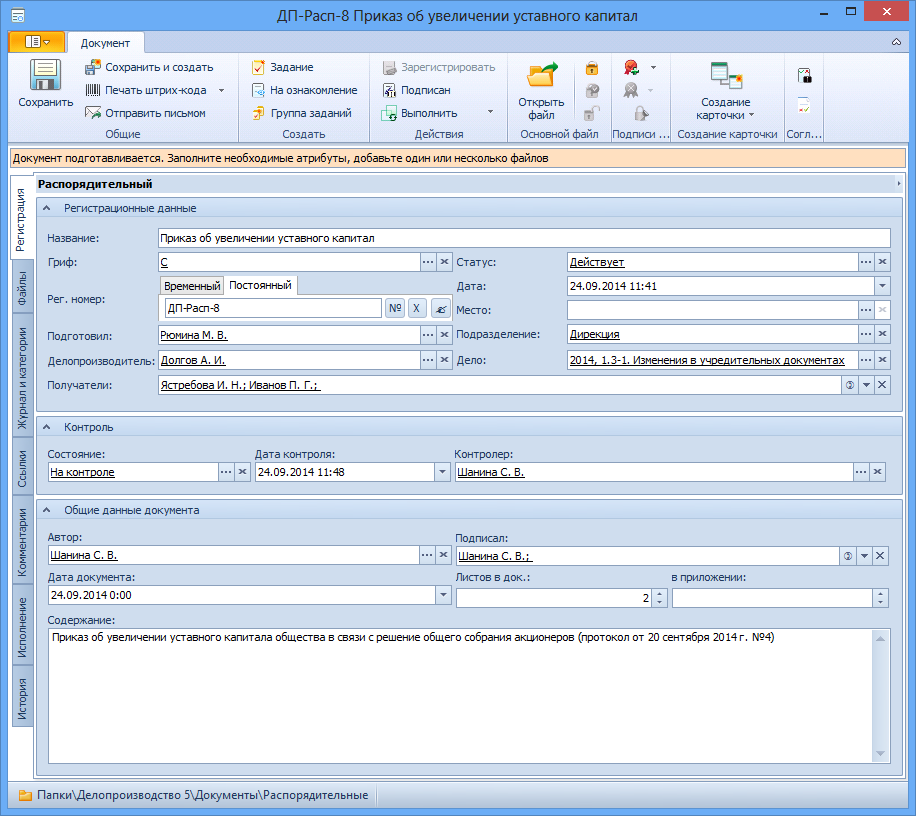

# Вкладка «Регистрация» распорядительного документа

Вкладка предназначена для хранения регистрационных данных распорядительного документа.

В каждый момент времени на форме вкладки Регистрация отображаются только поля, доступные для редактирования текущему пользователю в текущем состоянии карточки. Информация из остальных полей отображается в виде текста.

1. **Регистрационные данные**.
   1. **Название** – развернутое название документа. Значение вводится вручную.
   2. **Гриф** – реквизит, свидетельствующий о степени секретности сведений, содержащихся в документе. Выбирается из Конструктора справочников одним из способов: 
      - Непосредственно из справочника: 
        1. Нажмите кнопку выбора справа от поля.
        2. Выделите в открывшемся окне нужную строку справочника.
        3. Нажмите кнопку .
      - Быстрым поиском: 
        1. Введите в поле несколько идущих подряд символов (не менее трех) из названия грифа.
        2. Выберите нужный гриф в раскрывшемся списке.
   3. **Рег. номер** – регистрационный номер карточки распорядительного документа. См. раздел [Выделение номера документу](Selection_Numbers_Document.md).
   4. **Дата** – дата регистрации карточки. Значение  выбирается с помощью календаря или вводится вручную в формате, указанном в настройках операционной системы.
   5. **Место** – место регистрации карточки документа (например, филиал). Выбирается из Конструктора справочников одним из способов: 
      - Непосредственно из справочника: 
        1. Нажмите кнопку выбора справа от поля.
        2. Выделите в открывшемся окне нужную строку справочника.
        3. Нажмите кнопку .
      - Быстрым поиском: 
        1. Введите в поле несколько идущих подряд символов (не менее трех) из названия места регистрации.
        2. Выберите нужное место регистрации в раскрывшемся списке.
   6. **Дело** – дело Справочника номенклатуры дел 5, к которому отнесена карточка документа. Выбирается из Справочника номенклатуры дел 5 следующим образом:
      1. Нажмите кнопку выбора справа от поля.
      2. В открывшемся окне Справочника номенклатуры дел 5 [найдите нужное дело](Search_Case.md) и выделите его строку.
      3. Нажмите кнопку . 
   7. **Получатели** – получатели распорядительного документа в организации. См. раздел [Выбор получателей исходящего документа](Selection_of_Recipients_Out.md).
   8. **Подготовил** – сотрудник, подготовивший макет документа. По умолчанию в поле указаны ФИО сотрудника, создавшего карточку. Для выбора другого подготовившего нажмите кнопку с многоточием справа от поля, в открывшемся окне выберите нужного сотрудника и нажмите кнопку . Очистить поле можно, нажав кнопку .
   9. **Делопроизводитель** – сотрудник, регистрирующий документ, переводящий его в состояние Исполнен (если не указан контролер) и В архиве. Для выбора другого делопроизводителя нажмите кнопку **…** справа от поля, в открывшемся окне выберите нужного сотрудника и нажмите кнопку . Очистить поле можно, нажав кнопку .
   10. **Статус** – статус документа. Выбирается из Конструктора справочников одним из способов: 
       - Непосредственно из справочника: 
         1. Нажмите кнопку выбора справа от поля.
         2. Выделите в открывшемся окне нужную строку справочника.
         3. Нажмите кнопку .
       - Быстрым поиском: 
         1. Введите в поле несколько идущих подряд символов (не менее трех) из названия статуса.
         2. Выберите нужный статус в раскрывшемся списке.
   11. **Подразделение** – подразделение, которым получен документ. Выбирается из Справочника сотрудников. Для выбора нажмите кнопку **…** справа от поля, в открывшемся окне выберите нужное подразделение и нажмите кнопку . Очистить поле можно, нажав кнопку . Если поле пусто, то при сохранении карточки в него будет внесено подразделение, к которому причислен текущий сотрудник.
2. **Контроль**.
   1. **Состояние** – состояние работы с документом (На контроле или Снят с контроля). Выбирается из Конструктора справочников одним из способов: 
      - Непосредственно из справочника: 
        1. Нажмите кнопку выбора справа от поля.
        2. Выделите в открывшемся окне нужную строку справочника.
        3. Нажмите кнопку .
      - Быстрым поиском: 
        1. Введите в поле несколько идущих подряд символов (не менее трех) из названия вида контроля.
        2. Выберите нужный вид в раскрывшемся списке
   2. **Дата контроля**. Выбирается с помощью календаря или вводится вручную в формате, указанном в настройках операционной системы.
   3. **Контролер** – сотрудник, который будет осуществлять общий контроль карточки. Выбирается из Справочника сотрудников. Для выбора нажмите кнопку **…** справа от поля, в открывшемся окне выберите нужного сотрудника и нажмите кнопку . Очистить поле можно, нажав кнопку .
3. **Общие данные документа**.
   1. **Автор** – автор документа. По умолчанию в поле указаны ФИО сотрудника, создавшего карточку. Для выбора другого подготовившего нажмите кнопку **…** справа от поля, в открывшемся окне выберите нужного сотрудника и нажмите кнопку . Очистить поле можно, нажав кнопку .
   2. **Подписал** – сотрудник, подписавший документ. Выбирается из Справочника сотрудников. Для выбора нажмите кнопку **…** от поля, в открывшемся окне выберите нужного сотрудника и нажмите кнопку . Очистить поле можно, нажав кнопку .
   3. **Дата документа** – дата регистрации документа в издавшей его организации. По умолчанию в поле указана дата создания карточки. Изменить дату можно, выбрав ее из календаря или введя вручную в формате, указанном в настройках операционной системы.
   4. **Листов в док: <...>** – число листов в документе. Вводится с помощью счетчика или вручную.
   5. **в приложении** – число листов в приложении к документу. Вводится с помощью счетчика или вручную.
   6. **Содержание** – краткое описание документа. Значение вводится вручную.

