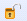

# Лента карточки входящего документа

1. **Общие**.
   1. **Сохранить** () – сохраняет сделанные в карточке изменения.
   2. **Сохранить и создать** () – сохраняет изменения и закрывает редактируемую карточку, открывает для регистрации новую карточку документа. Кнопка недоступна после регистрации документа.
   3. **Печать штрих-кода** () – открывает диалоговое окно для задания параметров печати штрих-кода.
   4. **Отправить письмом** () – Открывает окно «Отправка» для указания параметров отправки по электронной почте.
2. **Создать**.
   1. **Задание** () – открывает новую карточку подчиненного задания вида На исполнение.
   2. **На ознакомление** () – открывает карточку Группа заданий для выбора сотрудников, которые должны ознакомиться с документом, и срока ознакомления.
   3. **Группа заданий** () – открывает новую карточку подчиненной Группы заданий.
   4. **Резолюция** () – открывает новую карточку Резолюции по документу.
3. **Действия**.
   1. **Зарегистрировать** () – переводит документ в состояние Зарегистрирован.
   2. **В архив** () – переводит документ в состояние В архиве.
   3. **Исполнен** () – переводит документ в состояние Исполнен.
   4. **Выполнить** () – открывает список команд, доступных для выполнения в текущем состоянии карточки. Часть этих команд дублирует доступные кнопки ленты.
   5. **Отправить на рассмотрение** () – рассылает задания на рассмотрение получателям документа. Если поле Получатели пусто, то перед рассылкой заданий выводит на экран диалоговое окно «Выбор получателей» для выбора получателей.
4. **Основной файл.**
   1. **Открыть файл** () – открывает основной файл документа. Файл открывается в приложении, предназначенном для работы с файлами соответствующего формата.
   2. **Заблокировать для работы** () – открывает окно для выгрузки файла в файловую систему для работы с ним. На время блокировки работа с файлом в системе Docsvision становится невозможной.
   3. **Вернуть с блокировки** () – предлагает загрузить из файловой системы компьютера измененный файл.
   4. **Отменить блокировку** () – отменяет блокировку без сохранения изменений в файле.
5. **Подписи.**
   1. Подписи () – позволяет подписать операцию.
   2. Журнал подписей () – открывает окно журнала подписей.
   3. Шифрование файлов () – открывает окно шифрования файлов и подменю для выполнения действий с зашифрованными файлами.
6. **Создание карточки.**
   1. **Создание карточки** () – позволяет создать связанную карточку одного из видов, перечисленных в раскрывающемся списке кнопки.