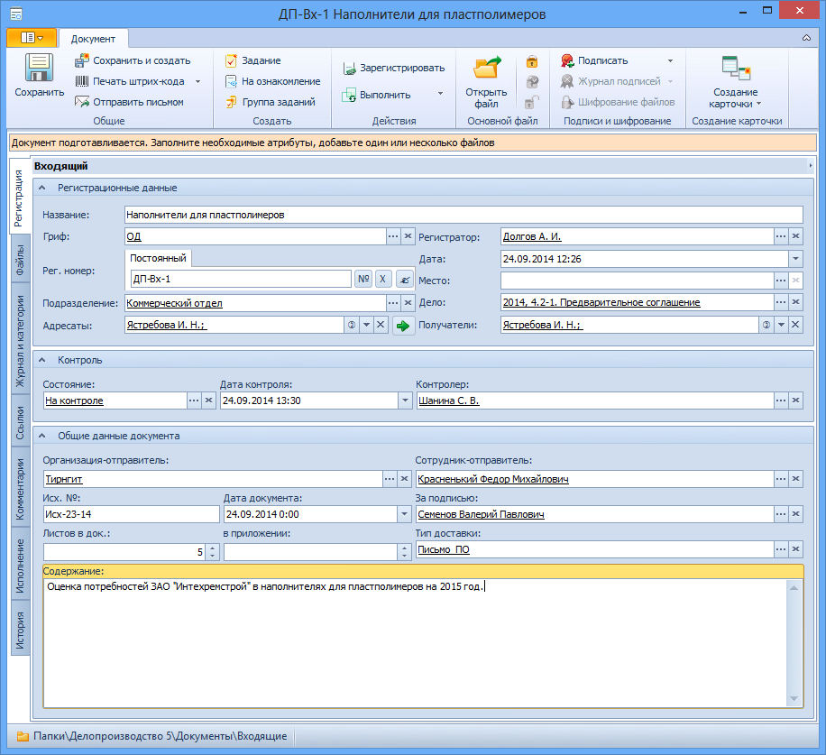

# Вкладка «Регистрация» карточки входящего документа

Вкладка предназначена для хранения регистрационных данных входящего документа.

В каждый момент времени на форме вкладки Регистрация отображаются только поля, доступные для редактирования текущему пользователю в текущем состоянии карточки. Информация из остальных полей отображается в виде текста.

1. **Регистрационные данные**.

   1. **Название** – развернутое название документа. Значение вводится вручную.

   2. **Рег. номер** – регистрационный номер карточки входящего документа. См. раздел [Выделение номера документу](Selection_Numbers_Document.md).

   3. **Дата** – дата регистрации карточки. Значение  выбирается с помощью календаря или вводится вручную в формате, указанном в настройках операционной системы.

   4. **Место** – место регистрации карточки документа (например, филиал). Значение выбирается из Конструктора справочников одним из способов:

      - Непосредственно из справочника: 
        1. Нажмите кнопку выбора справа от поля.
        2. Выделите в открывшемся окне нужную строку справочника.
        3. Нажмите кнопку .
      - Быстрым поиском: 
        1. Введите в поле несколько идущих подряд символов (не менее трех) из названия места регистрации.
        2. Выберите нужное место регистрации в раскрывшемся списке

   5. **Адресаты** – сотрудники, которому адресован документ. См. пункт [Выбор адресатов и получателей](Selection_of_Recipients_Inc.md). Очистить поле можно, нажав кнопку .

   6. **Получатели** – сотрудники, получившие документ. См. пункт [Выбор адресатов и получателей](Selection_of_Recipients_Inc.md). Очистить поле можно, нажав кнопку .

   7. – копирует значения поля Адресаты в поле Получатели.

   8. **Гриф** – реквизит, свидетельствующий о степени секретности сведений, содержащихся в документе. Выбирается из Конструктора справочников одним из способов: 

      - Непосредственно из справочника: 
        1. Нажмите кнопку выбора справа от поля.
        2. Выделите в открывшемся окне нужную строку справочника.
        3. Нажмите кнопку .
      - Быстрым поиском: 
        1. Введите в поле несколько идущих подряд символов (не менее трех) из названия грифа.
        2. Выберите нужный гриф в раскрывшемся списке.

      По умолчанию установлено значение грифа «ОД».

   9. **Регистратор** – сотрудник, зарегистрировавший документ. По умолчанию в поле указаны ФИО сотрудника, создавшего карточку. Для выбора другого регистратора нажмите кнопку **…** справа от поля, в открывшемся окне выберите нужного сотрудника и нажмите кнопку. Очистить поле можно, нажав кнопку .

   10. **Подразделение** – подразделение, которым получен документ. Выбирается из Справочника сотрудников. Для выбора нажмите кнопку **…** справа от поля, в открывшемся окне выберите нужное подразделение и нажмите кнопку . Очистить поле можно, нажав кнопку . Если поле пусто, то при сохранении карточки в него будет внесено подразделение, к которому причислен текущий сотрудник.

   11. **Дело** – дело Справочника номенклатуры дел 5, к которому отнесена карточка документа	Выбирается из Справочника номенклатуры дел 5 следующим образом:

       1. Нажмите кнопку выбора справа от поля.
       2. В открывшемся окне Справочника номенклатуры дел 5 найдите нужное дело и выделите его строку.
       3. Нажмите кнопку .

2. **Контроль**.

   1. **Состояние** – состояние работы с документом (На контроле или Снят с контроля). Значение выбирается из Конструктора справочников одним из способов: 
      - Непосредственно из справочника: 
        1. Нажмите кнопку выбора справа от поля.
        2. Выделите в открывшемся окне нужную строку справочника.
        3. Нажмите кнопку .
      - Быстрым поиском: 
        1. Введите в поле несколько идущих подряд символов (не менее трех) из названия вида контроля.
        2. Выберите нужный вид в раскрывшемся списке
   2. **Дата контроля**. Значение выбирается с помощью календаря или вводится вручную в формате, указанном в настройках операционной системы.
   3. **Контролер** – сотрудник, который будет осуществлять общий контроль карточки. Выбирается из Справочника сотрудников. Для выбора нажмите кнопку **…** справа от поля, в открывшемся окне выберите нужного сотрудника и нажмите кнопку . Очистить поле можно, нажав кнопку .

3. **Общие данные документа**.

   1. **Организация-отправитель** – отправитель документа. Заполняется автоматически при выборе Сотрудника-отправителя или выбирается из Справочника контрагентов. Для выбора нажмите кнопку **…** справа от поля, в открывшемся окне выберите нужную организацию и нажмите кнопку . Очистить поле можно, нажав кнопку .
   2. **Сотрудник-отправитель** – сотрудник организации, отправившей документ. Значение выбирается из Справочника контрагентов. Для выбора нажмите кнопку **…** справа от поля, в открывшемся окне выберите нужного сотрудника и нажмите кнопку . Очистить поле можно, нажав кнопку .
   3. **Исх. номер** – номер, присвоенный документу отправителем (контрагентом) при отправке из сторонней организации. Значение вводится вручную.
   4. **За подписью** – сотрудник организации контрагента, подписавший документ. Значение выбирается из справочника контрагентов. Для выбора нажмите кнопку **…** справа от поля, в открывшемся окне выберите нужное лицо и нажмите кнопку .Очистить поле можно, нажав кнопку .
   5. **Тип доставки** – способ, с помощью которого документ был доставлен в организацию. Выбирается из Конструктора справочников одним из способов: 
      - Непосредственно из справочника: 
        1. Нажмите кнопку выбора справа от поля.
        2. Выделите в открывшемся окне нужную строку справочника.
        3. Нажмите кнопку .
      - Быстрым поиском: 
        1. Введите в поле несколько идущих подряд символов (не менее трех) из названия типа доставки.
        2. Выберите нужный тип в раскрывшемся списке.
   6. **Дата документа** – дата регистрации документа в издавшей его организации. По умолчанию в поле указана дата создания карточки. Изменить дату можно, выбрав ее из календаря или введя вручную в формате, указанном в настройках операционной системы.
   7. **Листов в док: <...>** – число листов в документе. Вводится с помощью счетчика или вручную.
   8. **в приложении** – число листов в приложении к документу. Вводится с помощью счетчика или вручную.
   9. **Содержание** – краткое описание документа. Значение вводится вручную.