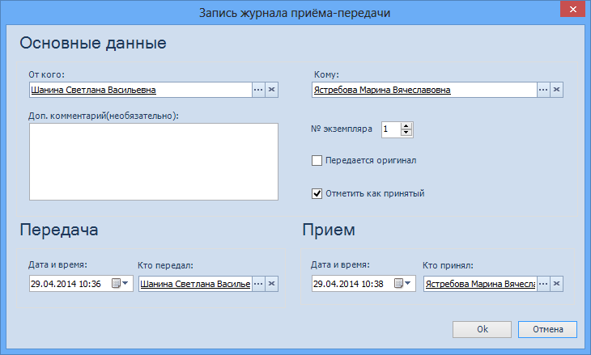

# Запись в журнале приема-передачи документа

Для добавления/редактирования записей Журнала приема используется диалоговое окно Запись журнала приема-передачи.

1. **Основные данные**.
   1. **От кого** – сотрудник или подразделение, от имени которого производится передача документа. Поле обязательно для заполнения. По умолчанию в поле указаны ФИО сотрудника, создавшего запись о приеме-передаче. Для выбора другого лица, от имени которого передается документ, нажмите кнопку **…** справа от поля, в открывшемся окне выберите нужного сотрудника или подразделение и нажмите кнопку . Очистить поле можно, нажав кнопку .
   2. **Кому** – сотрудник или подразделение, которому передаётся документ. Поле обязательно для заполнения. Выбирается из Справочника сотрудников. Для выбора нажмите кнопку **…** справа от поля, в открывшемся окне выберите нужного сотрудника или подразделение и нажмите кнопку . Очистить поле можно, нажав кнопку .
   3. **Доп. комментарий** (необязательно) – комментарий к операции передачи или приёма документа. Вводится вручную.
   4. **№ экземпляра** – номер копии или оригинала. Вводится вручную или с помощью счетчика.
   5. **Передаётся оригинал** – отметка о том, какой документ передаётся: оригинал или копия. Проставляется вручную.
   6. **Отметить как принятый** – отметка о приёме документа. Проставляется вручную или автоматически при проставлении аналогичной отметки в таблице Журнала приема-передачи. Отметку можно снять.
2. **Передача**.
   1. **Дата и время** – дата и время создания записи о передачи. По умолчанию - текущая дата. Может быть изменена с помощью календаря или вручную (вводится в формате, указанном в настройках операционной системы).
   2. **Кто передал** – сотрудник или подразделение, который фактически зарегистрировал факт передачи документа. По умолчанию в поле копируются данные из поля От кого. Для выбора другого лица, зарегистрировавшего документ, нажмите кнопку **…** справа от поля, в открывшемся окне выберите нужного сотрудника или подразделение и нажмите кнопку . Очистить поле можно, нажав кнопку .
3. **Приём**.
   1. **Дата и время** – дата и время приёма документа. Проставляется автоматически в момент проставления отметки о приёме документа в таблице Журнала приема-передачи или установки флага Отметить как принятый (см. выше).
   2. **Кто принял** – сотрудник или подразделение, который фактически принял документ. По умолчанию в поле указаны ФИО сотрудника, создавшего запись о приеме-передаче. Для выбора другого лица, принявшего документ, нажмите кнопку **…** справа от поля, в открывшемся окне выберите нужного сотрудника или подразделение и нажмите кнопку . Очистить поле можно, нажав кнопку .