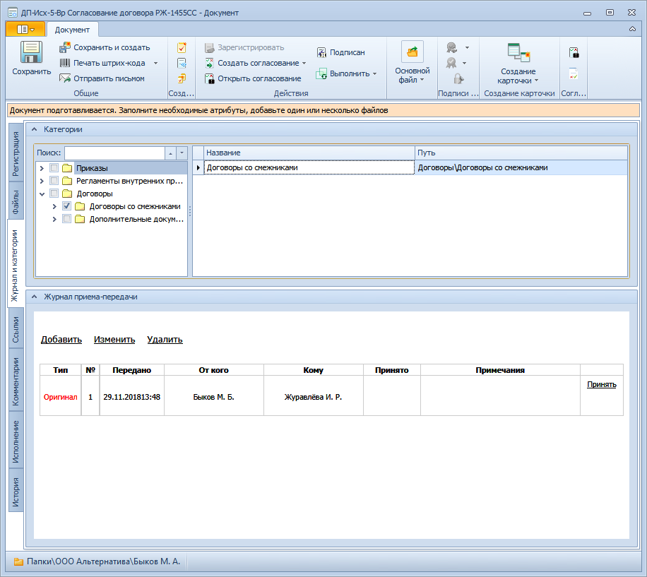

# Вкладка «Журнал и категории»

Вкладка предназначена для причисления карточки к категории и ведения Журнала приема-передачи документа.

Журнал передач предназначен для учета информации о движении физических (бумажных) экземпляров документов (оригиналов и копий) между сотрудниками и подразделениями.

Прием-передача карточки ДокументДП вида Организационный не предполагается. Соответственно, аналогичная вкладка карточки этого вида – Категории – предназначена только для причисления карточки к категории, на ней отсутствует Журнала приема-передачи документа.

1. **Категории** – предназначено для причисления карточки ДокументДП к категории. Cм. пункт [Отнесение документа к категории](Doc_Categorization.md).
2. **Журнал приема-передачи**.
   1. **Журнал приема-передачи** – таблица, в строках которой отображаются сведения о движении бумажного экземпляра документа. Cм. пункт [Прием-передача документа](Acceptance_Transfer_of_Documents.md).
   2. **Добавить** – открывает окно «Запись журнала приема-передачи» для ввода сведений о новой операции приема или передачи документа.
   3. **Изменить** – открывает окно «Запись журнала приема-передачи» для изменении сведений о выделенной в таблице «Журнал приема-передачи» записи о приеме или передаче документа.
   4. **Удалить** – удаляет выделенную в таблице «Журнал приема-передачи» запись о приеме или передаче документа.

