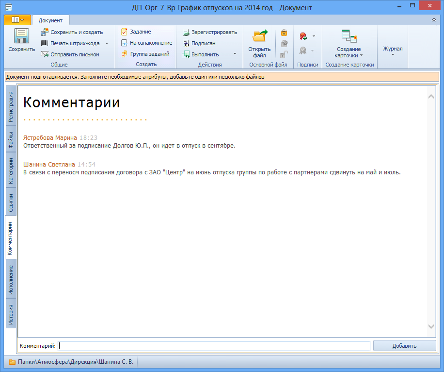

# Вкладка «Комментарии»

Вкладка предназначена для ввода комментариев к документу.

Поля и кнопки вкладки «Комментарии»:

1. **Таблица комментариев** – комментарии лиц, работающих с документом.
2. **Комментарий** –  поле для ввода текста комментария. Значение вводится вручную.
3. **Добавить** – кнопка, при нажатии которой текст, набранный в поле Комментарий, вносится в таблицу комментариев.

