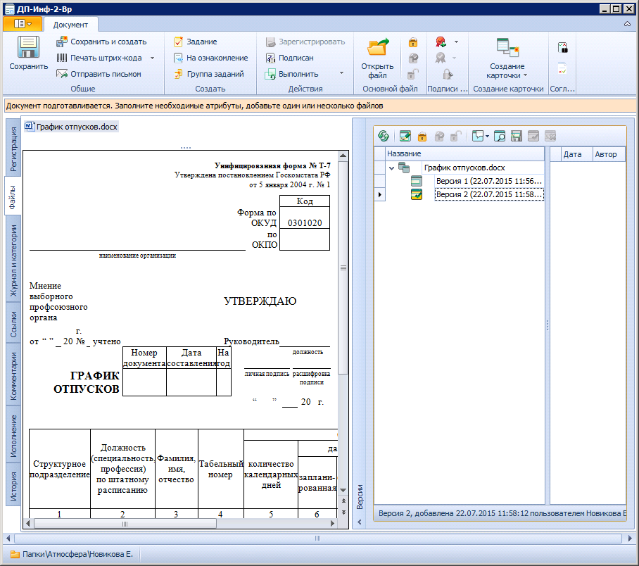

# Вкладка «Файлы»

Вкладка Файлы предназначена для хранения файлов и просмотра их листа согласования.

Поля вкладки «Файлы»:

1. **Файлы** – в поле отображаются ссылки на прикрепленные к карточке основные и дополнительные файлы. См. пункт [Прикрепление файлов к карточке документа](Doc_File_Attach.md)
2. **Версии** – в секции отображается дерево версий файла и содержатся кнопки для управления версиями. См. документ *Модуль «Docsvision 5. Базовые объекты». Руководство пользователя*, пункт «Вкладка 'Версии'»