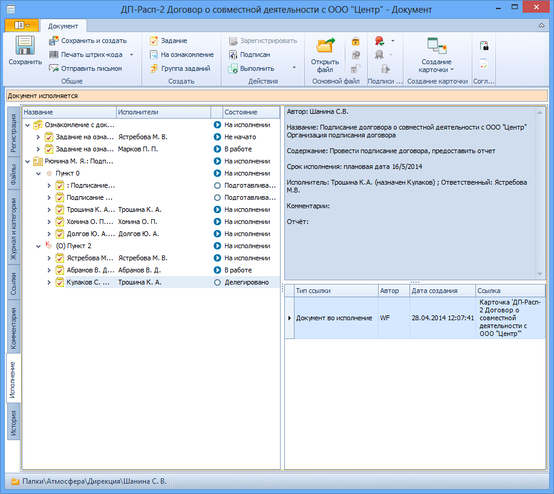

# Вкладка «Исполнение»

Вкладка предназначена для отслеживания текущего состояния и текущих исполнителей заданий и резолюций, созданных из карточки документа.

Поля вкладки «Исполнение»:

1. **Дерево исполнения** – отображает хода исполнения заданий по документу в виде упорядоченной иерархической структуры. При запуске (или сохранении) задания документу в дерево добавляется новая ветка.