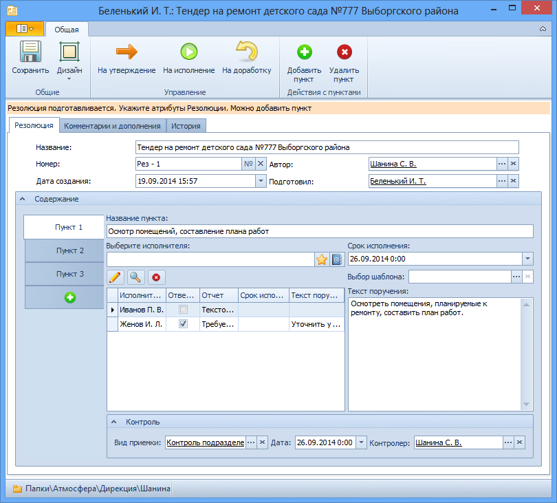
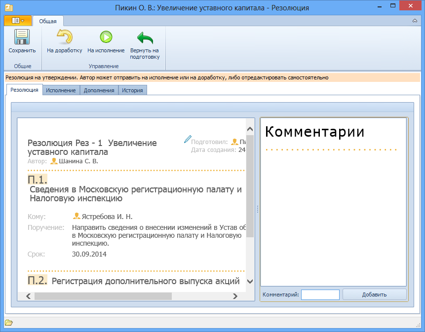

# Интерфейс карточки «Резолюция» в различных состояниях

Внешний вид карточки Резолюция зависит от стадии жизненного цикла карточки и прав сотрудника, открывшего карточку. Различаются две формы карточки Резолюция – для редактирования и для чтения.

## Форма резолюции для редактирования
Данная форма предназначена для указания и редактирования атрибутов резолюции. Используется на этапе создания карточки Резолюция, отправки ее на исполнение/на утверждение.

Кроме того, в этой форме открывается присланная на утверждение резолюция, если ее Автор внесен в группу Автор Резолюции – Редактор Справочника сотрудников.

## Форма резолюции для чтения
Данная форма предназначена для ознакомления сотрудников с запущенной и завершенной резолюцией.

Кроме того, в этой форме открывается присланная на утверждение резолюция, если ее Автор не внесен в группу Автор резолюции – редактор Справочника сотрудников. В этом случае форма позволяет добавить комментарии к пунктам резолюции и отправить ее на доработку/на исполнение.

Для корректного отображения карточки Резолюции в форме для чтения на компьютере пользователя должен быть установлен веб-браузер Internet Explorer версии 9.0 или выше, иначе данные резолюции будут отображаться в виде простого текста (без соответствующей разметки).