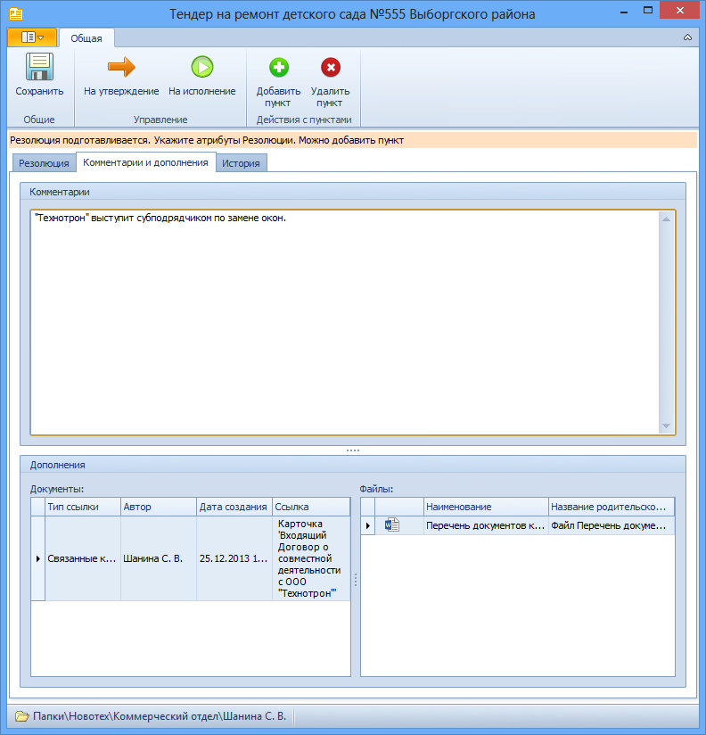

# Вкладка «Комментарии и дополнения»

Вкладка предназначена для ввода комментариев и прикрепления сопроводительных документов и файлов.

1. **Комментарии** – комментарии автора и/или сотрудника, подготовившего резолюцию. Текст вводится вручную. Поле доступно в состоянии Подготавливается, На утверждении и На доработке.
2. **Дополнения**.
   1. **Документы** – таблица приложенных документов, содержащая ссылки на карточки документов, с которыми должны ознакомиться исполнители заданий по резолюции. Для добавления документа:
      1. Выберите из контекстного меню поля опцию Добавить карточку.
      2. В окне «Выберите карточку» выберите уже существующую карточку Docsvision
   2. **Файлы** – таблица приложенных файлов документов, содержащая ссылки на файлы, с которыми должны ознакомиться исполнители заданий по резолюции. Для добавления файла:
      1. Выберите из контекстного меню поля опцию Добавить файл.
      2. В окне «Выберите файл документа» выберите файл файловой системы.

