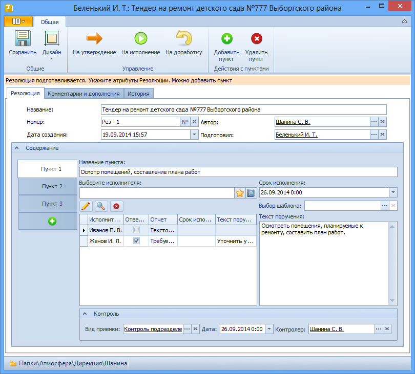
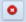

# Вкладка «Резолюция»

Вкладка предназначена для хранения основных сведений о резолюции и формирования ее пунктов.

Различают две формы карточки Резолюция:

- форма для редактирования предназначена для указания и редактирования атрибутов резолюции; используется на этапе создания карточки Резолюция, отправки ее на исполнение/на утверждение;
- форма для чтения предназначена для ознакомления с резолюцией пользователей, не имеющих необходимости в редактировании атрибутов резолюции или пользователей, которым такие изменения не разрешены.

В данном разделе описана вкладка Резолюция в форме для редактирования.

1. **Регистрационные данные**.
   1. **Название** – название резолюции. Вводится вручную.
   2. **Номер** – номер карточки резолюции. Выделяется при нажатии кнопки , расположенной справа от поля Номер
   3. **Дата создания** – дата создания резолюции. Выбирается с помощью календаря или вводится вручную в формате, указанном в настройках операционной системы.
   4. **Автор** – сотрудник, от чьего имени будут рассылаться задания по резолюции. По умолчанию в поле указаны ФИО сотрудника, создавшего карточку. Для выбора другого автора нажмите кнопку выбора справа от поля, в открывшемся окне выберите нужного сотрудника и нажмите кнопку . Очистить поле можно, нажав кнопку .
   5. **Подготовил** – подготовивший резолюцию. По умолчанию в поле указаны ФИО сотрудника, создавшего карточку. Для выбора другого подготовившего нажмите кнопку выбора справа от поля, в открывшемся окне выберите нужного сотрудника и нажмите кнопку . Очистить поле можно, нажав кнопку .
2. **Содержание**.
   1. **Название пункта** – название пункта резолюции. Значение вводится вручную.
   2.  –  кнопка перехода к пункту резолюции. При нажатии кнопки в таблице исполнителей открывается список исполнителей заданий выбранного пункта и их настроек исполнения.
   3.  – кнопка добавления нового пункта в список пунктов резолюции.
   4. **Выберите исполнителя** – поле для выбора исполнителя задания. См. пункт [Выбор исполнителя задания](Task_create_performer.md).
   5. **Таблица исполнителей** – таблица с перечислением исполнителей заданий пункта резолюции и параметров их заданий (вида отчета, срока исполнения, текста поручения, ответственного исполнителя). Новая строка добавляется в таблицу автоматически после выбора исполнителя в поле Выберите исполнителя. Параметры задания вводятся вручную (см. пункт [Формирование пункта резолюции](Add_Executive_Resolution.md)).
   6.  – кнопка перехода к пункту резолюции. При нажатии кнопки в таблице исполнителей открывается список исполнителей заданий выбранного пункта и их настроек исполнения.
   7.  – кнопка для просмотра текста поручения по выбранному в таблице заданию.
   8.  – кнопка удаления выбранного в таблице задания.
   9. **Срок исполнения** – общий срок исполнения заданий пункта. Выбирается с помощью календаря или вводится вручную в формате, указанном в настройках операционной системы.
   10. Выбор шаблона – поле для выбора шаблона текста поручения. Выбирается из Конструктора справочников одним из способов:
       - Непосредственно из справочника:
         1. Нажмите кнопку выбора справа от поля.
         2. Выделите в открывшемся окне нужную строку справочника.
         3. Нажмите кнопку .
       - Быстрым поиском:
         1. Введите в поле несколько идущих подряд символов (не менее трех) из кода шаблона.
         2. Выберите нужный вид в раскрывшемся списке.
   11. **Текст поручения** – общий текст поручения заданий пункта. Вводится вручную или заполняется автоматически при заполнении поля Выбор шаблона.
3. **Контроль**.
   1. **Вид приемки** – вид приемки результатов исполнения задания. Выбирается из Конструктора справочников одним из способов:
      - Непосредственно из справочника:
        1. Нажмите кнопку выбора справа от поля.
        2. Выделите в открывшемся окне нужную строку справочника.
        3. Нажмите кнопку .
      - Быстрым поиском:
        1. Введите в поле несколько идущих подряд символов (не менее трех) из названия вида приемки.
        2. Выберите нужный вид в раскрывшемся списке.
   2. **Дата** – дата контроля пункта резолюции. Выбирается с помощью календаря или вводится вручную в формате, указанном в настройках операционной системы.
   3. **Контролер** – может отслеживать процесс исполнения всех заданий пункта резолюции. Выбирается из Справочника сотрудников одним из способов: 
      - Непосредственно из справочника:
        1. Нажмите кнопку выбора справа от поля.
        2. Выделите в открывшемся окне нужную строку справочника.
        3. Нажмите кнопку .
      - Быстрым поиском:
        1. Введите в поле несколько идущих подряд символов (не менее трех) из названия вида приемки.
        2. Выберите нужный вид в раскрывшемся списке.

