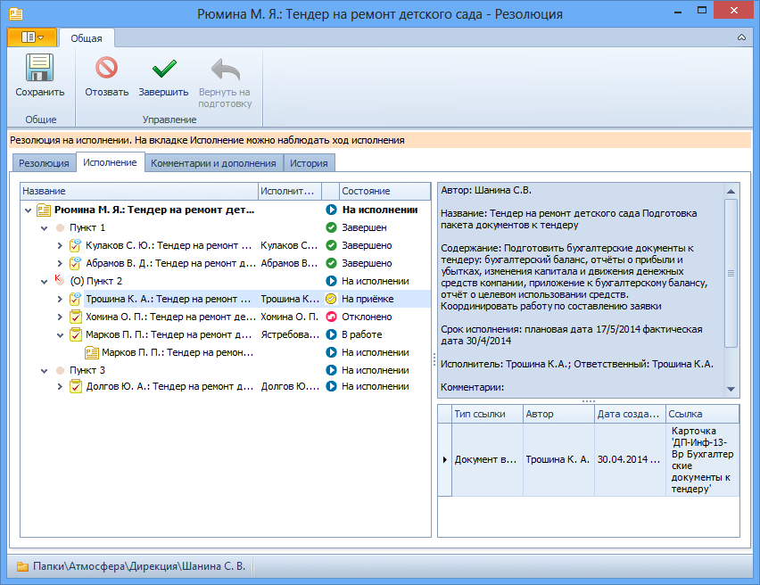

# Вкладка «Исполнение»

На вкладке размещен элемент управления [Дерево резолюций](Tree_Resolution.md).

Поля вкладки «Исполнение»:

1. **Дерево резолюций** – отображает ход исполнения заданий в виде упорядоченной иерархической структуры(дерева). Создается автоматически при запуске резолюции на исполнение. Изменяется и дополняется автоматически при создании дочерних резолюций и внесении изменений в запущенную резолюцию.

