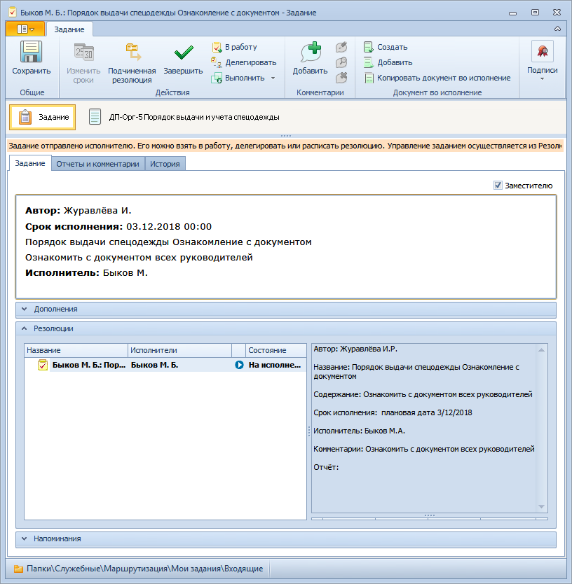

# Задание «По резолюции»

Задание вида По резолюции используется для совершения операций с отдельным заданием по резолюции в процессе его исполнения. Карточка задания этого вида создается автоматически из карточки Резолюция при ее отправке на исполнение.

Пользовательский интерфейс карточки включает следующие элементы: Лента инструментов, Строки состояния, вкладки Задание, Отчеты и комментарии, История.

Сотрудник, получивший задание По резолюции, может создать подчиненную резолюцию либо сразу перейти непосредственно к [исполнению](Task_Fulfil.md) задания.

