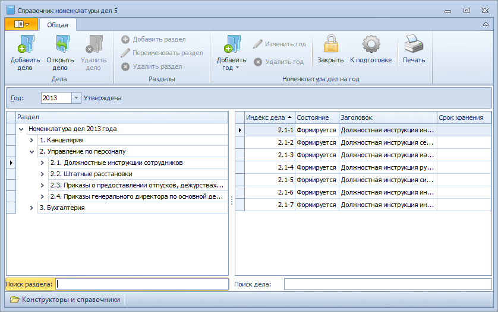

# Закрытие номенклатуры дел

Утвержденная номенклатура дел закрывается по окончании периода действия. Для закрытия номенклатуры выполните:

1. Откройте Справочник номенклатуры дел 5.

2. Выберите в поле Год нужную номенклатуру дел.

3. Нажмите кнопку **Закрыть** на ленте справочника.

   

4. В открывшемся диалоговом окне подтвердите закрытие номенклатуры, нажав кнопку **Да**.

Номенклатура дел будет переведена в состояние «Закрыта», все дела номенклатуры будут переведены в состояние «Закрыто». Списание в такое дело разрешено только в случае, если в карточке дела установлен флажок **Разрешить списание в закрытое дело**.

