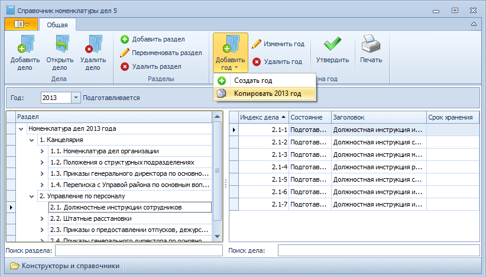
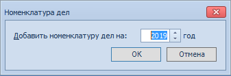

# Копирование номенклатуры

Если должна быть создана номенклатура дел, структура которой полностью или частично совпадает со структурой какой-нибудь из уже имеющихся номенклатур, новую номенклатуру можно создать копированием.

Для копирования номенклатуры дел на год выполните следующие действия:

1. Откройте Справочник номенклатуры дел 5.

   

2. Выберите в поле Год номенклатуру, структуру которой предполагается скопировать.

3. Последовательно выберите команды **Добавить год** → **Копировать <номер года> год**.

4. В открывшемся окне «Номенклатура дел» введите год действия номенклатуры в поле Добавить номенклатуру дел на: <...> год.

   

5. Нажмите кнопку **OK**.

В новую номенклатуру дел будут скопированы разделы и дела исходной номенклатуры. При этом:

- разделы будут скопированы с сохранением иерархической структуры;
- в карточки дел будут скопированы все регистрационные данные;
- привязанные к карточкам документы (отображаются в таблице в нижней части карточки дела) скопированы не будут, за исключением случая, когда в деле установлена отметка «Переходящее».