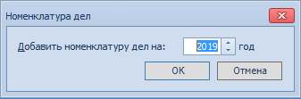

# Создание новой номенклатуры дел

Для создания номенклатуры дел на год выполните:

1. Откройте Справочник номенклатуры дел 5.

2. Нажмите на ленте инструментов справочника кнопку **Добавить год** → **Создать год**.

   

3. В открывшемся окне Номенклатура дел введите год действия номенклатуры в поле Добавить номенклатуру дел на: <...> год.

   

4. Нажмите кнопку **OK**.

Дерево созданной номенклатуры будет открыто на левой панели справочника. Это дерево будет содержать только корневой элемент Номенклатура дел <номер года номенклатуры> года. Далее в номенклатуру нужно будет добавить разделы, а в каждом из разделов создать дела.