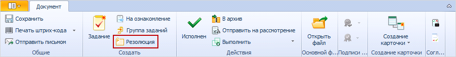

# Создание резолюции из карточки документа

Создать резолюцию можно из карточки ДокументДП вида Распорядительный и Информационно-справочный.

Карточки этих видов предназначены для работы с документами, носящим распорядительный характер (например, приказ), поэтому актуальным является сценарий создания резолюции непосредственно из карточки.

Опция создания резолюции доступна делопроизводителю в документе, находящемся в состоянии «Зарегистрирован».

Для создания резолюции из карточки распорядительного документа выполните следующие действия:

1. Откройте карточку задания и ознакомьтесь с приложенным документом.

2. Нажмите кнопку **Резолюция**.

   

3. Будет открыта новая карточка Резолюция с перечисленными параметрами:

   - в таблицу Документы вкладки Комментарии и документы будет добавлена ссылка на родительскую карточку документа (тип ссылки – «Основной документ»); при создании заданий по резолюции эта карточка документа будет помещена на панель вложений как основной документ;
   - в поле Автор карточки будет скопировано значение из поля Получатели родительской карточки ДокументДП; если в карточке документа указаны несколько получателей, то поле Автор будет оставлено пустым;
   - в поле Подготовил будут сохранены данные текущего пользователя.

4. [Заполните поля](Schedule_Resolution.md) карточки резолюции.

5. Отправьте резолюцию [на исполнение](Sent_Resolution_for_Execution.md) или [на утверждение](Sent_Resolution_for_Approval.md).