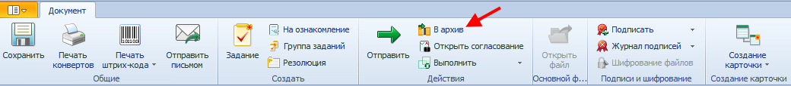

# Перевод документов в архив

Списать в архив можно карточку любого дочернего вида карточки ДокументДП; операция перевода документа в архив выполняется, когда закончена активная работа с документом.

Списать документ в архив могут сотрудники, исполняющие в нем роли «Получатель», «Делопроизводитель» подразделения или «Регистратор» входящих документов, причем:

- «Получателю» операция перевода в архив доступна после рассмотрения документа; для ее выполнения следует перейти из задания На рассмотрение в карточку документа;
- «Делопроизводитель» или «Регистратор» входящих документов могут списать в архив из следующих состояний:
  - «Зарегистрирован» – после регистрации документа;
  - «Отправлен» – после отправки исходящего документа;
  - «Исполнен» – после того, как контролёр переведёт документ в это состояние.
  
  > Если в карточке ДокументДП не указан Контролер, то Регистратор входящих документов или Делопроизводитель должны вначале перевести документ в состояние «Исполнен», и только потом – «В архив».

Для перевода документа в архив желательно, чтобы в карточке было указано Дело номенклатуры дел, к которому принадлежит документ.

Для выполнения операции нажмите кнопку **В архив** в карточке ДокументДП.

Документ при этом перейдет в состояние «В архиве».С карточкой списанного в архив документа разрешены следующие действия:

- Входящий документ разрешено вернуть в состояние «Исполнен» или «Зарегистрирован»;
- Исходящий документ разрешено вернуть в состояние «Отправлен» или «Зарегистрирован»;
- Организационный документ разрешено вернуть в состояние «Зарегистрирован»;
- Распорядительный и Информационно-справочный документы разрешено вернуть в состояние «Исполнен» или «Зарегистрирован».

