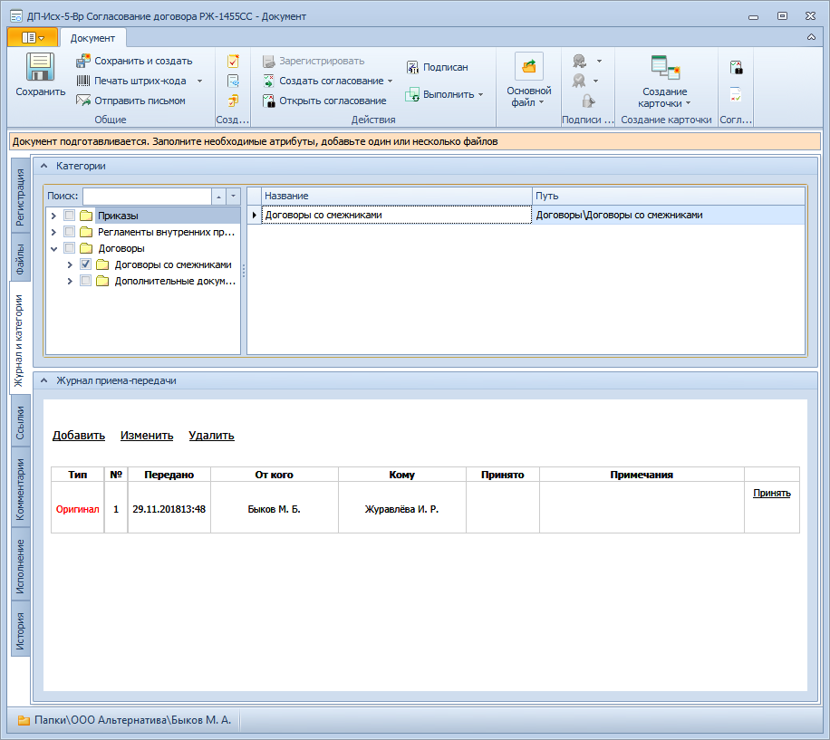

# Категоризация документа

Принадлежность карточки к категории может использоваться при ее поиске в системе или для группировки при построении отчетов.

Список доступных категорий формируется в Справочнике категорий.

Для отнесения документа к категории выполните следующие действия:

1. Откройте карточку ДокументДП.

2. Перейдите на вкладку Категории.

   

3. Установите флаги в дереве категорий напротив нужных названий.