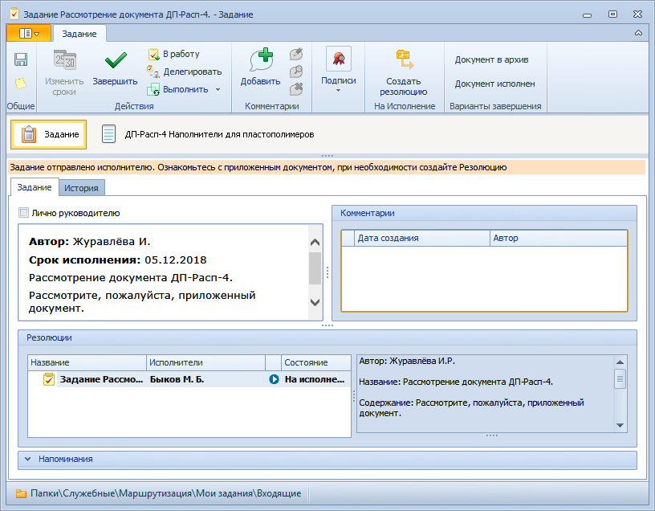

# Рассмотрение документа должностным лицом

Как правило, документ поступает на рассмотрение исполнителю в виде файла, приложенного к заданию вида На рассмотрение.

Порядок рассмотрения документа зависит от того, нуждается ли он в исполнении или нет. В общем случае для рассмотрения документа следует выполнить следующие действия:

1. Откройте карточку задания На рассмотрение.

   

2. [Ознакомьтесь](Task_Familiarization_with_Documents.md) с приложенными к заданию файлами документа. Для этого щелкните по значку файла под лентой инструментов карточки задания; документ будет открыт в приложении, предназначенном для работы с файлами данного типа.

3. Если документ требует исполнения, то выполните действия:

   - нажмите кнопку **Создать резолюцию** () на ленте инструментов карточки;
   - [заполните поля](Schedule_Resolution.md) открывшейся новой карточки Резолюция;
   - [отправьте резолюцию на исполнение](Sent_Resolution_for_Execution.md).

   После отправки резолюции на исполнение документ, по которому было создано задание На рассмотрение, переводится в состоянии На исполнении, задание завершается, а карточка задания автоматически закрывается.

4. Если документ не требует исполнения, нажмите кнопку **Документ исполнен** или **Документ в архив**.

   Документ будет переведен в состояние Исполнен или В архиве соответственно. Задание На рассмотрение будет завершено, карточка задания будет закрыта.