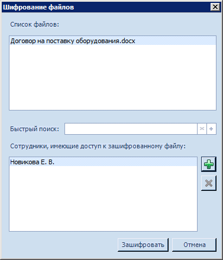
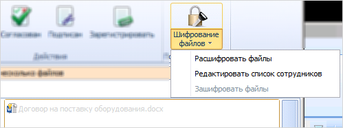

# Шифрование файлов

Возможность шифрования файлов реализована для базового типа карточки Документ и настроена во всех видах карточек ДокументДП (кроме вида Рабочий) для пользователей с ролью «Регистратор», «Делопроизводитель», «Подготовил» в состояниях «Подготовка», «Зарегистрирован», «В работе», «В архиве».

Шифрование в карточках становится доступным только после настройки администратором параметров шифрования для модуля «Docsvision 5. Базовые объекты». В Конструкторе ролей для шифрования используется операция Шифрование файлов.

Шифрование в карточках становится доступным только для тех пользователей, у которых в Справочнике сотрудников указан сертификат.

Для зашифрованных файлов разрешено создание заданий и групп заданий, но запрещена отправка на согласование. На вкладке Ссылки запрещен просмотр зашифрованных файлов для сотрудников, у которых не настроен доступ к зашифрованным файлам.

Чтобы зашифровать файлы карточки, выполните следующие действия:

1. Откройте карточку вида Документ УД.

2. На ленте карточки нажмите на кнопку .

   Если шифрование выполняется для дополнительных файлов, в списке рядом с их названием появится пометка о том, что файл является дополнительным. Будет открыто окно «Шифрование файлов».

   

3. В списке **Список файлов** выберите файл, для которого требуется настроить шифрование.

   Шифрование выполняется сразу для всех файлов, однако список сотрудников, которые будут иметь доступ к зашифрованному файлу, необходимо сформировать отдельно для каждого из файлов.

4. Укажите сотрудников, которые могут иметь доступ к зашифрованному файлу. Для добавления сотрудника в список:

   - нажмите на кнопку  и выберите запись из Справочника сотрудников;
   - введите первые буквы имени сотрудника в строку быстрого поиска, затем дважды щелкните левой клавишей мыши на найденной записи.

   Допускается выбор только тех сотрудников, у которых в Справочнике сотрудников указан сертификат подписи. Если сертификат отсутствует, при подтверждении выбора будет выдано предупреждение: «Не удалось добавить сотрудника. У пользователя <ФИО> отсутствует сертификат. Обратитесь к администратору системы».

5. Нажмите на кнопку **Зашифровать**. При этом возможно появление окна для выбора сертификата подписи.

6. Укажите тип подписи, затем нажмите на кнопку **ОК**.

   Если сертификат валиден, будет выполнено шифрование файлов (основных и/или дополнительных) в соответствии с настройками провайдера, алгоритма и ключа из справочника Системные настройки. Сертификаты пользователей, указанных в списке, будут получены из настроек Справочника сотрудников. Для каждого из указанных пользователей формируется ключ.

   В карточке название зашифрованного файла изменит цвет на серый, а в иконке файла появится значок, указывающий, что файл зашифрован.

   Зашифрованный файл будет отображаться в списке файлов документа для всех пользователей, имеющих доступ к данной карточке, однако прочитать такой файл могут только пользователи, у которых настроен доступ к зашифрованному файлу. Если доступа нет, будет выдано сообщение: «Файл зашифрован. Не удалось выполнить операцию в связи с ограничением прав доступа». При открытии на чтение зашифрованного файла будет выполнена автоматическая дешифровка файла и выгрузка его во временную папку.

   У пользователя, который выполнил шифрование файлов, на ленте карточки станет доступным выпадающее меню кнопки Шифрование файлов, содержащее команды для управления зашифрованными файлами.

   

7. Если в карточку был добавлен новый файл (основной и/или дополнительный), для его шифрования выберите в меню кнопки команду **Зашифровать файлы**.

   Если для дополнительных файлов шифрование в справочнике Системные настройки не настроено, при добавлении к карточке дополнительного файла команда для шифрования файлов останется недоступной. После расшифровывания становится возможным его редактирование.

8. Чтобы расшифровать файлы, выберите в меню кнопки команду **Расшифровать файлы**. Файлы будут расшифрованы и станут доступны всем пользователям.

9. Чтобы отредактировать список сотрудников, для которых было выполнено шифрование, выберите в меню кнопки команду **Редактировать список сотрудников**, в открывшемся окне отредактируйте список и затем нажмите на кнопку **Зашифровать**.

   Аналогичные действия будут выполнены при нажатии на кнопку **Шифрование файлов**. При изменении состава сотрудников будет выполнено повторное шифрование файлов с учетом изменений. При этом, возможно, будет запрошен сертификат подписи.