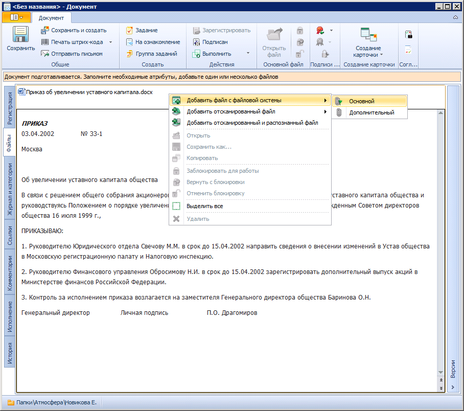

# Прикрепление файлов

К карточке ДокументДП может быть прикреплено произвольное количество файлов различных форматов. Одни из них считаются основными, другие – дополнительными.

Для операций с файлами служит контекстное меню, открываемое на вкладке Файлы в области отображения списка прикреплённых файлов.

1. Для прикрепления файла, созданного или полученного в электронном виде, выберите пункт меню **Добавить файл с файловой системы** как **Основной** или **Дополнительный**. Можно добавить несколько основных файлов.
2. При необходимости прикрепите файл отсканированного документа, выбрав пункт контекстного меню **Добавить отсканированный файл** или **Добавить отсканированный и распознанный файл** для выполнения сканирования из карточки.
3. Прикрепление основных и дополнительных файлов возможно путём "перетаскивания" из файловой системы или Microsoft Outlook в зону основных или дополнительных файлов.
4. Для удаления файла выделите удаляемый файл в списке прикреплённых файлов и выберите пункт контекстного меню **Удалить**. Также можно воспользоваться клавишей «Delete».