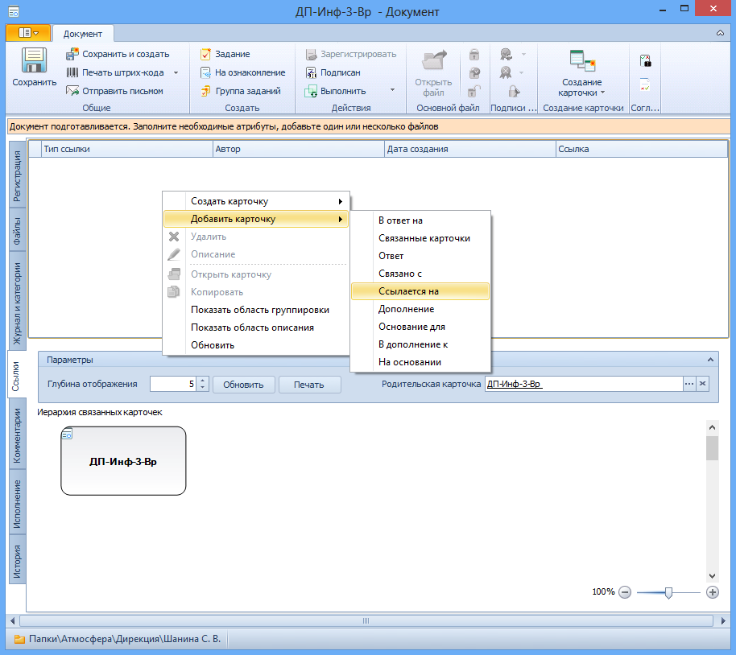
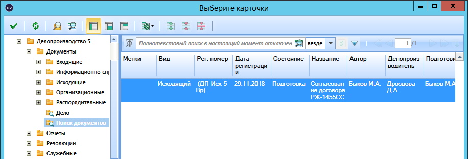

# Указание связанного документа

Указать существующую в системе карточку, связанную с данным документом, можно следующим способом:

1. Откройте карточку ДокументаДП и перейдите на вкладку Ссылки.

2. Откройте контекстное меню в области Документы и выберите пункт меню Добавить карточку и тип ссылки, с которой она будет добавлена.

   

   Будет открыто диалоговое окно «Параметры поиска» для указания параметров связываемого документа.

3. В окне «Параметры поиска» укажите параметры, которым должен соответствовать связываемый документ.

4. В открывшемся окне Выберите карточки укажите карточки, с которыми связан документ, и нажмите кнопку  на панели инструментов.

   

   Выбранные карточки будут отображены список ссылок карточки.