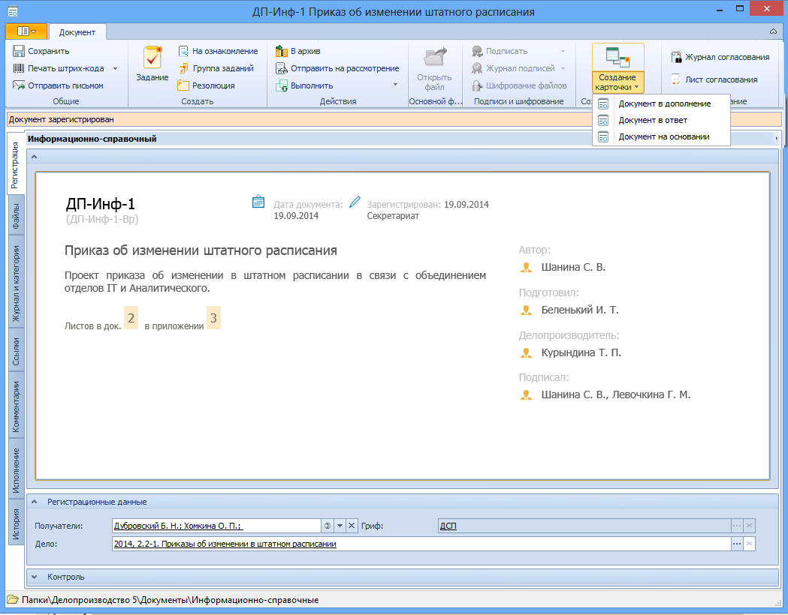

# Создание связанного документа по кнопке «Создание карточки»

Для создания связанной карточки документа с заранее заданными параметрами выполните следующие действия:

1. Нажмите кнопку **Создание карточки** и выберите из раскрывающегося списка режим создания карточки.

   

   По умолчанию в раскрывающемся списке кнопки **Создать карточку** доступны следующие варианты создания ссылок в зависимости от типа ссылки:

   - Документ в ответ:

     - из карточки вида Входящий создается карточка Исходящий;
     - из карточки вида Исходящий создается карточка Входящий;
     - из карточки вида Информационно-справочный создается аналогичная карточка.

     Связанная карточка документа создается с перечисленными ниже параметрами.

     - Связанная карточка будет приложена с типом ссылки В ответ на (обратная: Ответ).
     - В поле Подразделение связанной карточки будет скопировано значение из поля Подразделение родительской карточки.
     - В поле Получатель исходящего документа будет скопировано значение поля Отправитель входящего документа и наоборот.
     - В поле Содержание вставляется текст В ответ на <вид, номер, дата>.
     - В поле Автор связанного информационно-справочного документа копируется значение поля Получатели родительского документа.

   - Документ в дополнение:

     - из карточки вида Входящий создается аналогичная карточка;
     - из карточки вида Исходящий создается аналогичная карточка;
     - из карточки вида Информационно-справочный создается аналогичная карточка;
     - из карточки вида Организационный создается аналогичная карточка;
     - из карточки вида Распорядительный создается аналогичная карточка.

     Связанная карточка документа создается с перечисленными ниже параметрами.

     - Связанная карточка будет приложена с типом ссылки В дополнение к (обратная: Дополнение).
     - В связанную карточку копируются значения следующих полей родительской карточки:
       - Подразделение;
       - Адресаты;
       - Получатели;
       - Получатели-контрагенты;
       - Отправитель.

   - Документ на основании:

     - из карточки вида Входящий создается аналогичная карточка;
     - из карточки вида Исходящий создается аналогичная карточка;
     - из карточки вида Информационно-справочный создается аналогичная карточка;
     - из карточки вида Организационный создается аналогичная карточка;
     - из карточки вида Распорядительный создается аналогичная карточка.

     Связанная карточка будет приложена с типом ссылки На основании (обратная: Основание для).

2. Если это предусмотрено выполненными администратором настройками режима создания, выберите папку, в которой будет создана карточка.

3. В открывшейся новой карточке документа заполните необходимые поля и прикрепите необходимые файлы, как описано в пункте [Прикрепление файлов](Doc_File_Attach.md).