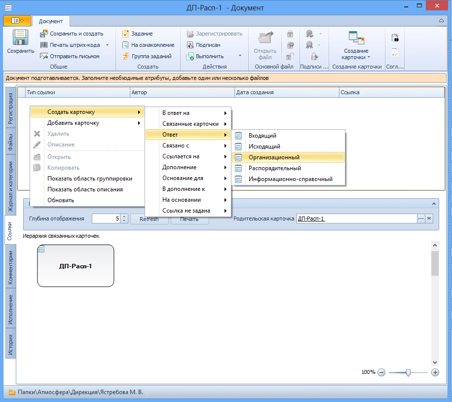

# Создание связанной карточки документа произвольного вида

Для создания из карточки ДокументДП связанной карточки ДокументДП произвольного вида выполните следующие действия:

1. Откройте карточку документа и перейдите на вкладку Ссылки.

2. Из контекстного меню верхнего поля вкладки выберите тип связи и вид документа, который требуется создать.

   

3. В созданной карточке документа заполните необходимые поля и прикрепите необходимые файлы, как описано в пункте [Прикрепление файлов](Doc_File_Attach.md).