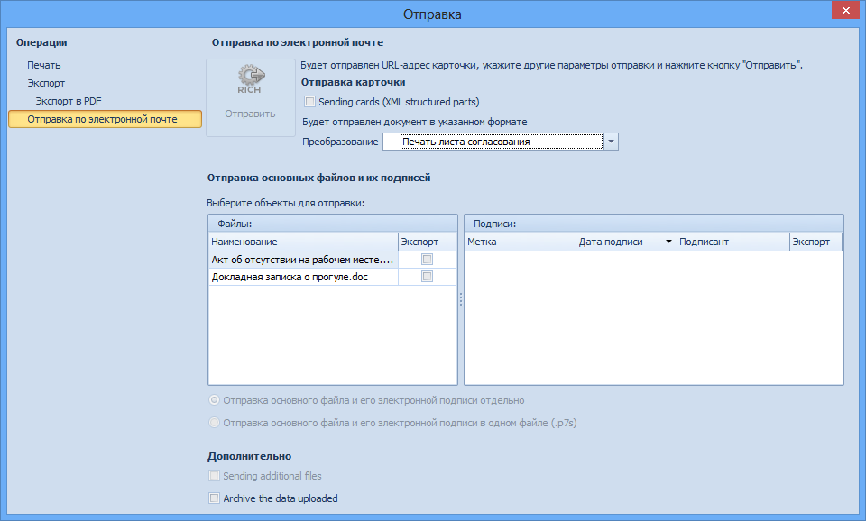

# Отправка письмом

Чтобы отправить ссылку на карточку ДокументДП по электронной почте, выполните следующие действия:

1. Откройте окно Отправка одним из следующих способов:

   - нажмите на кнопку **Отправить письмом** на ленте сохраненной карточки;

   - в меню кнопки Документ в верхнем левом углу карточки ДокументДП выберите пункт Отправка, затем в открывшемся одноименном окне выберите пункт Отправка по электронной почте.

     

2. Выполните необходимые настройки. Описание приведено в документе Модуль «Docsvision 5. Базовые объекты». Руководство пользователя, пункт «Отправка данных карточки по электронной почте».

3. Нажмите на кнопку **Отправить**.

   Будет создано письмо со ссылкой на документ. В соответствии с настройками, к письму могут быть приложены основные или дополнительные файлы, подписи или структурированная часть карточки.