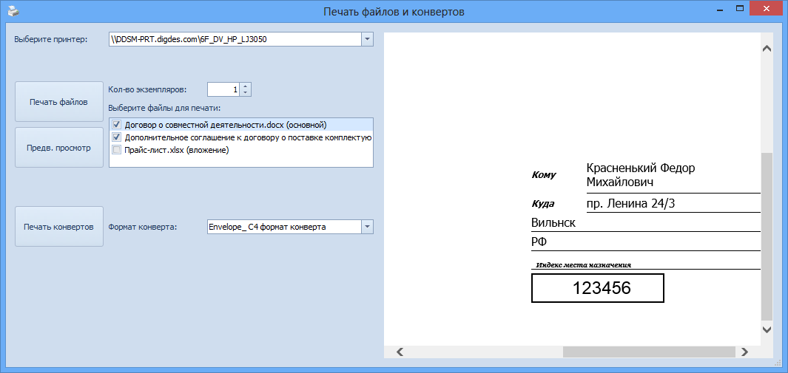

# Печать конвертов и файлов исходящего документа

Чтобы распечатать файлы документа и конверт для отправки исходящего документа адресатам, выполните следующие действия:

1. Откройте карточку ДокументДП - Исходящий в состоянии «Зарегистрирован».

2. Нажмите кнопку **Печать конвертов**.

   Будет открыто диалоговое окно для указания параметров печати конверта.

   

3. Укажите параметры печати:

   1. Выберите принтер, на котором будет производиться печать.

   2. В списке «Выберите файлы для печати» выберите файлы документа, которые требуется распечатать вместе с конвертом; основные файлы по умолчанию выбраны.

   3. В поле Количество экземпляров укажите количество экземпляров, которое требуется распечатать; по умолчанию в поле устанавливается значение, соответствующее количеству получателей, для которых указан тип доставки «Почтовое сообщение».

   4. Выберите из раскрывающегося списка Формат конверта: C4 (229x324 мм) или DL/E65 (110x220 мм).

      > Администратор может добавить другие форматы печати конвертов.

4. Нажмите кнопку **Печать файлов**, чтобы распечатать содержимое выбранных файлов.

5. Нажмите кнопку **Печать конвертов**, чтобы распечатать конверт.

   Будет распечатано по 1 экземпляру конвертов для каждого получателя, у которого указан тип доставки с названием, содержащим постфикс «_ПО». Адрес получателя будет указан в строке «Куда».

   В строке «Откуда» будет напечатан адрес, указанный в поле Почтовый адрес карточки подразделения отправителя в Справочнике сотрудников. Если для текущего подразделения это поле пусто, то данные будут взяты из карточки первого вышестоящего подразделения, для которого почтовый адрес указан.