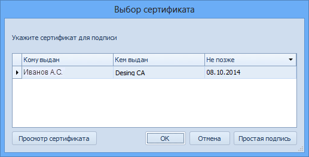
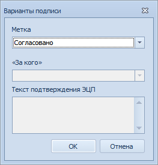

# Наложение произвольной подписи

В карточке документа предусмотрена возможность наложить произвольную электронную подпись, указав метку и/или от имени кого накладывается подпись.

> Для возможности выполнения операций с электронными подписями необходима предварительная настройка, выполняемая Администратором системы.

1. Для наложения электронной подписи без метки от своего имени нажмите на ленте инструментов карточки кнопку .

   При выводе окна «Выбор сертификата» (выводится в случае, если установленный сертификат не совпадает с настроенным в справочнике сотрудников) выберите один из действующих сертификатов (если их несколько) и нажмите кнопку **ОК** – для наложения усиленной подписи, либо кнопку **Простая подпись** – для наложения простой подписи.

   

2. Для наложения подписи с меткой от своего имени выберите в выпадающем меню кнопки **Подписать** пункт Варианты. В открывшемся окне Варианты подписи выберите метку (из числа доступных) и нажмите кнопку **ОК**.

   

3. Для наложения подписи вместо другого сотрудника (при наличии соответствующих полномочий), в окне Варианты подписи выберите метку (из числа доступных) и в поле «<От кого>» – фамилию замещаемого сотрудника.

   В поле Текст подтверждения ЭЦП возможен ввод произвольного текста подтверждения.