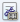

# Фиксация факта подписания документа без предварительного согласования

Если ДокументДП вида Информационно-справочный, Исходящий, Организационный или Распорядительный требует подписания, но не требует предварительного согласования, то факт подписания бумажного оригинала фиксируется в карточке следующим образом:

1. Откройте карточку ДокументДП в состоянии «Подготовка».

2. Нажмите на кнопку **Подписан** ().

   Карточка будет переведена в состояние «Подписан».

