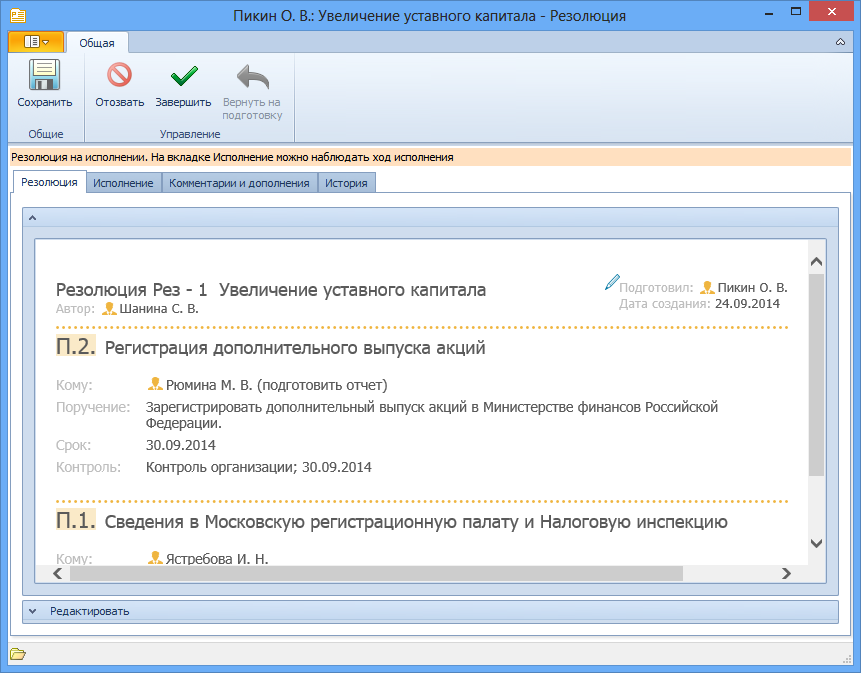
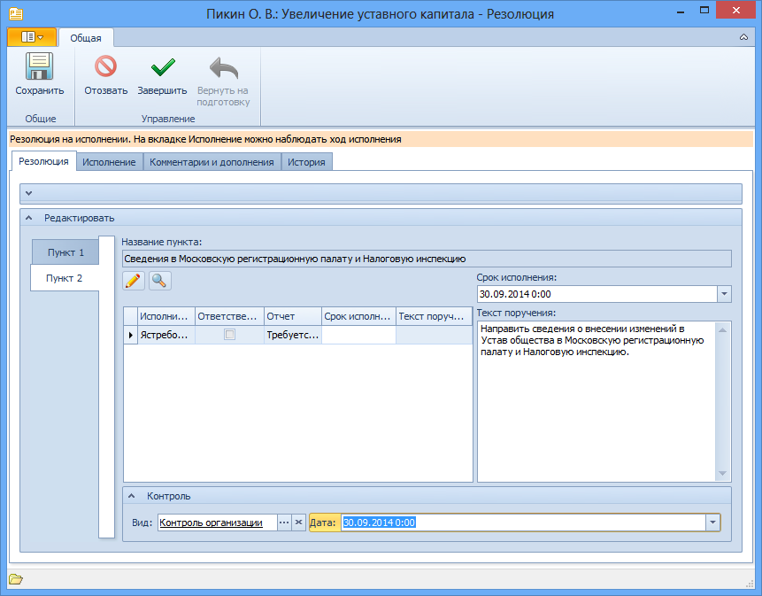
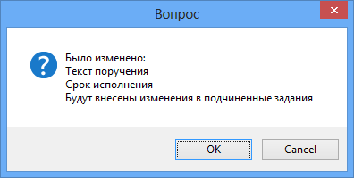

# Изменение контроля исполнения резолюции

В запущенной резолюции можно снять с контроля/поставить на контроль пункт резолюции, изменить вид и дату контроля. Для этого:

1. Откройте карточку резолюции в состоянии «На исполнении». Карточка будет открыта в форме для чтения.

   

2. Раскройте секцию Редактировать, чтобы получить возможность внести изменения в резолюцию.

3. Перейдите к пункту резолюции, для которого нужно изменить параметры контроля. Для этого нажмите в секции Содержание кнопку **Пункт <номер нужного пункта>**.

4. При необходимости разверните секцию Контроль, щелкнув левой кнопкой мыши по стрелке в левом нижнем углу секции Содержание.

   

5. Измените параметры контроля, воспользовавшись описанием, данным в пункте [Постановка пункта резолюции на контроль](Setting_control.md).

6. Сохраните изменения, нажав кнопку **Сохранить** ленты карточки.

   На экран будет выведено диалоговое окно с перечислением всех внесенных изменений, в котором следует подтвердить или отменить их. При подтверждении изменений параметры контроля будут изменены во всех заданиях пункта резолюции, а карточки этих заданий будут помечены как непрочтенные.

   

