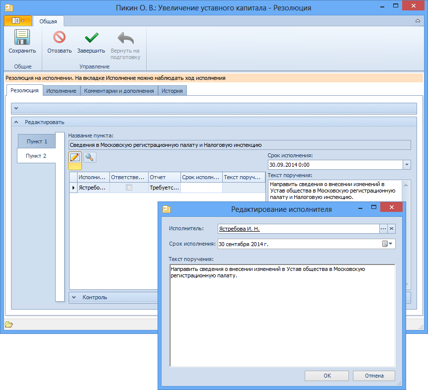
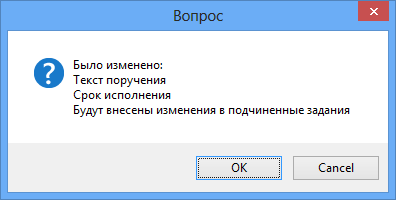

# Изменение текста поручения резолюции

Для изменения текста поручения запущенной резолюции выполните:

1. Откройте карточку резолюции в состоянии «На исполнении». Карточка будет открыта в форме для чтения.

   

2. Раскройте секцию Редактировать, чтобы получить возможность внести изменения в резолюцию.

3. Перейдите к пункту резолюции, текст поручения по которому нужно изменить. Для этого нажмите в секции Содержание кнопку **Пункт <номер нужного пункта>**.

4. Измените текст поручения:

   - Если требуется изменить текст поручения для всех заданий в выбранном пункте, то введите новый текст в поле Текст поручения.

   - Если нужно изменить текст поручения в конкретном задании, то выделите в таблице исполнителей нужную строку, нажмите кнопку , в открывшемся окне Редактирование исполнителя измените Текст поручения и нажмите кнопку OK. 

     

5. Нажмите на ленте инструментов карточки кнопку **Сохранить**.

   На экран будет выведено диалоговое окно с перечислением всех внесенных изменений, в котором следует подтвердить или отменить их. При подтверждении изменений они будут применены ко всем заданиям первого уровня пункта резолюции, а карточки этих заданий будут помечены как непрочтенные.

   