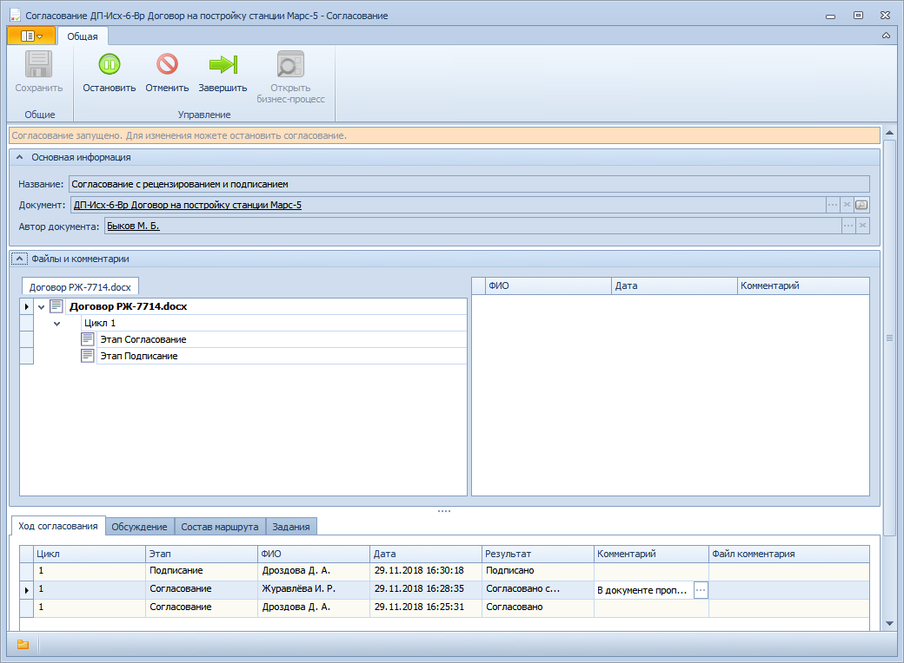

# Просмотр карточки Согласование. Управление активным согласованием

Для открытия карточки согласования, запущенного из карточки документа, выполните следующие действия: 

1. Откройте карточку документа ДокументДП вида Информационно-справочный, Исходящий, Организационный или Распорядительный.

2. Нажмите кнопку **Открыть согласование** и ознакомьтесь с его параметрами.

   Кнопка **Открыть согласование** доступна пользователям, исполняющим в карточке роли Подготовил, Делопроизводитель и Получатель.

   

3. Если открытое согласование активно, то пользователь имеет возможность управлять его ходом при помощи кнопок, расположенных на ленте инструментов карточки Согласование:

   - Остановить – временная остановка согласования;
   - Запустить (приостановленное согласование);
   - Отменить – принудительная остановка согласования;
   - Завершить – принудительное завершение.