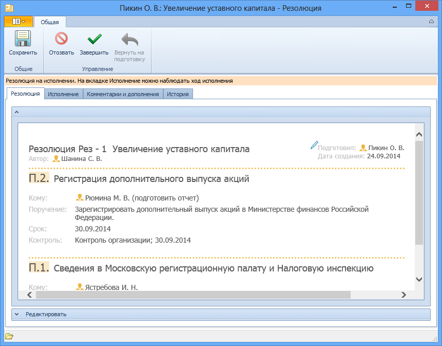

# Перенос сроков исполнения

Для переноса сроков исполнения заданий пункта резолюции выполните:

1. Откройте карточку резолюции в состоянии «На исполнении». Карточка будет открыта в форме для чтения.

   

2. Раскройте секцию Редактировать, чтобы получить возможность внести изменения в резолюцию.

3. Перейдите к пункту резолюции, сроки исполнения которого нужно изменить. Для этого нажмите в секции Содержание кнопку **Пункт <номер нужного пункта>**.

4. Выберите новый срок исполнения:

   - Если требуется изменить срок исполнения всех заданий, то нажмите кнопку со стрелкой справа от поля Срок исполнения и выберите новую дату из календаря.

   - Если нужно изменить срок исполнения одного задания, то выделите в таблице заданий нужную строку, нажмите кнопку , в открывшемся окне Редактирование исполнителя измените Срок исполнения (для этого нужно нажать кнопку со стрелкой и выбрать новую дату из календаря) и нажмите кнопку **OK**.

     

5. Нажмите на ленте инструментов карточки кнопку **Сохранить**.

   На экран будет выведено диалоговое окно с перечислением всех внесенных изменений, в котором следует подтвердить или отменить их. При подтверждении изменений они будут внесены во все задания пункта резолюции, а карточки этих заданий будут помечены как непрочтенные.

   

   > Изменение общего срока исполнения заданий пункта не затрагивает указанные ранее индивидуальные сроки исполнения заданий.

