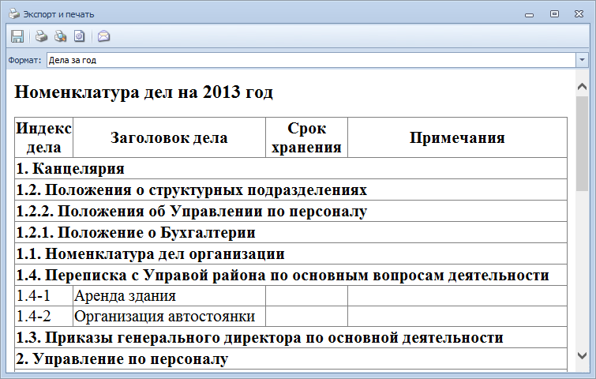

# Печать номенклатуры дел на год

Чтобы распечатать номенклатуру дел на год, выполните следующие действия:

1. Откройте Справочник номенклатуры дел 5.

2. Выберите в поле Год номенклатуру, которую нужно распечатать.

3. Нажмите на ленте кнопку **Печать**. Откроется окно Экспорт и печать.

   

4. В окне Экспорт и печать нажмите кнопку **Печать**.

> При необходимости в окне Экспорт и печать перед распечатыванием номенклатуры дел можно просмотреть/изменить параметры печати и предварительно просмотреть страницу.