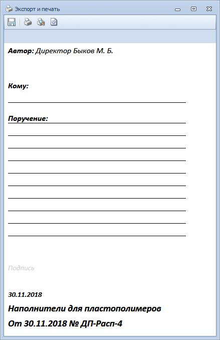
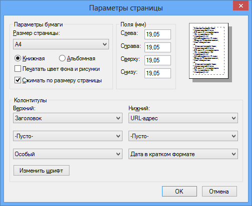

# Печать бланка резолюции

Чтобы распечатать бланк резолюции, выполните следующие действия:

1. Откройте карточку задания На рассмотрение в состоянии «На утверждении».

2. Нажмите кнопку **Печать бланка Резолюции**.

   Будет открыто диалоговое окно для предварительного просмотра, задания параметров и печати бланка резолюции.

   

3. Для указания параметров печати, отличных от установленных по умолчанию, нажмите кнопку Параметры страницы и заполните поля открывшегося окна.

   

4. Чтобы увидеть, как будет выглядеть распечатанный бланк резолюции, нажмите кнопку **Предварительный просмотр**.

5. Для печати бланка нажмите кнопку **Печать**.