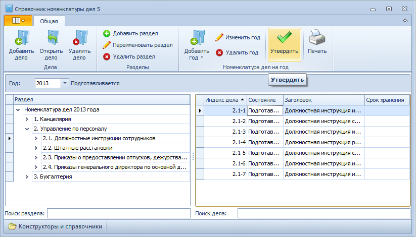

# Утверждение номенклатуры дел

Номенклатура дел утверждается после окончательной разработки ее структуры. Редактировать утвержденную номенклатуру (изменять дерево разделов или год) нельзя, но с ней доступны операции: 

- прикрепление документа к карточке дела;
- добавление дела, находящегося в состоянии «Подготавливается»;
- удаление дела, находящегося в состоянии «Подготавливается».

Для утверждения номенклатуры выполните следующие действия:

1. Откройте Справочник номенклатуры дел 5.

2. Выберите в поле Год номенклатуру дел, которую необходимо утвердить.

3. Нажмите кнопку **Утвердить** на ленте справочника.

   

4. В открывшемся окне нажмите кнопку **Да** для подтверждения утверждения.

Номенклатура дел будет утверждена; одновременно все дела этой номенклатуры будут переведены в состояние «Формируется».

Утвержденную номенклатуру дел всегда можно вернуть в состояние «Подготавливается», нажав кнопку **К подготовке** на ленте справочника.